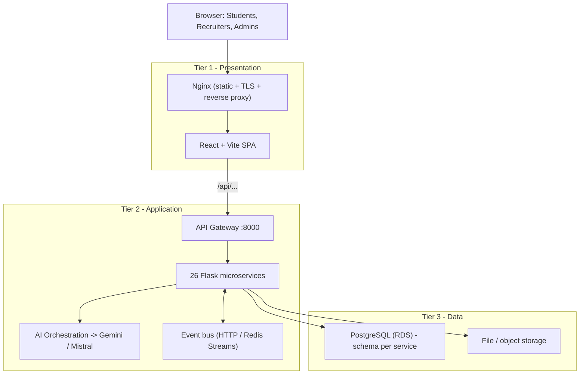
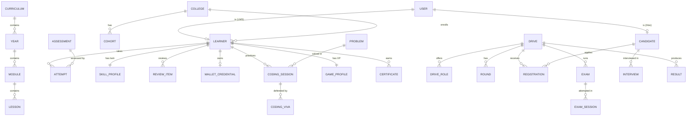
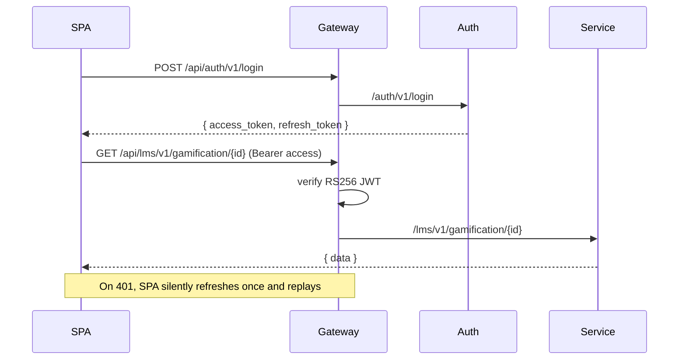
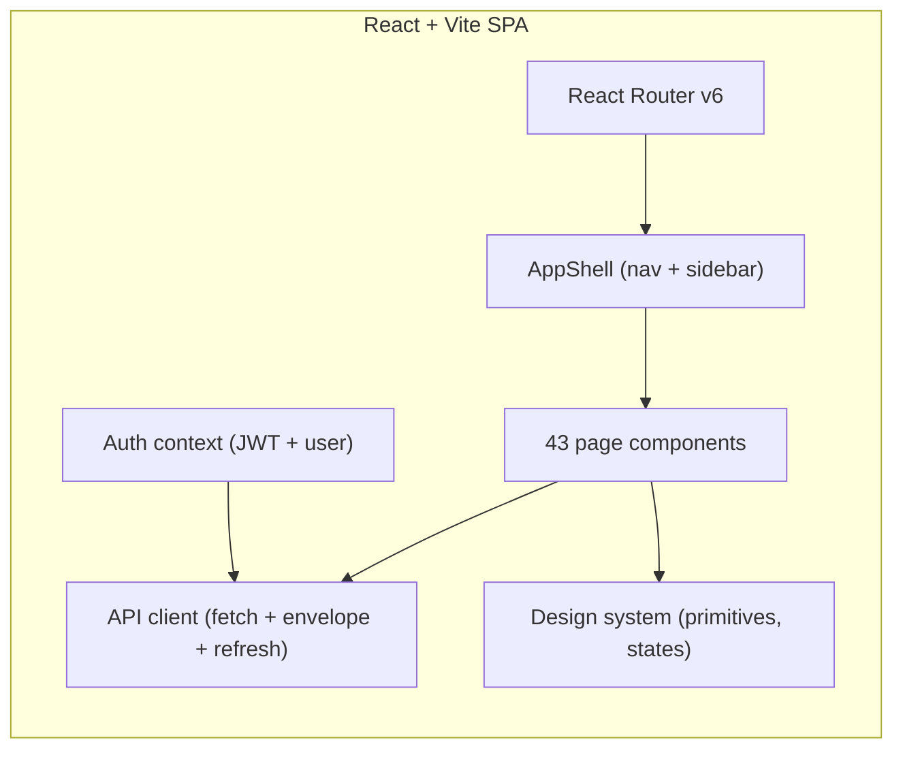
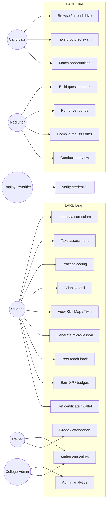
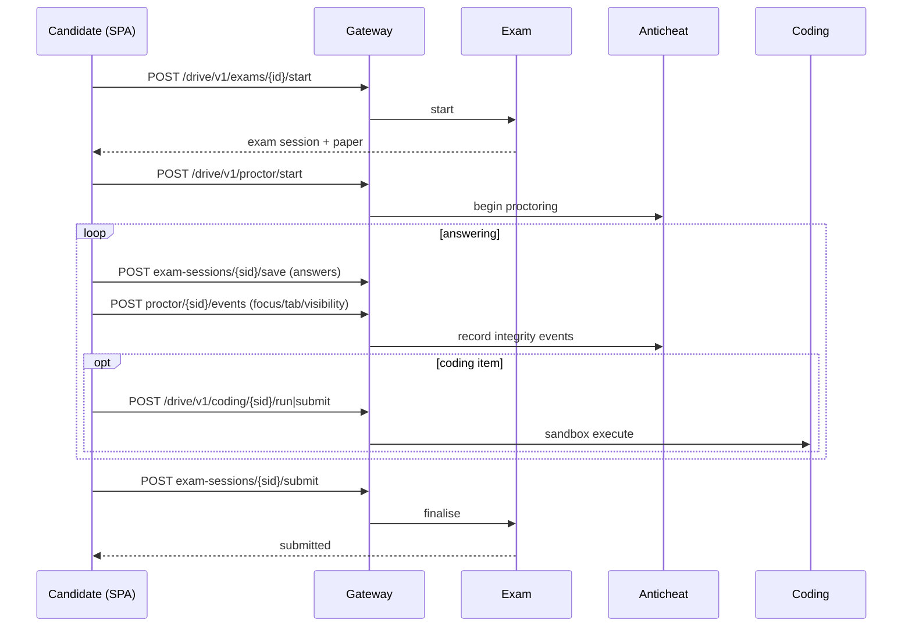
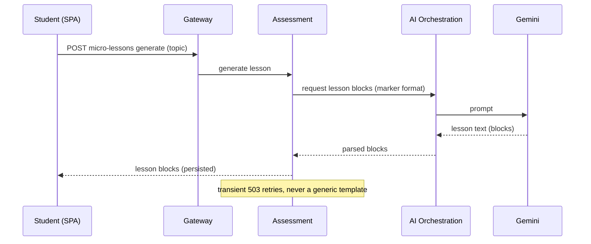
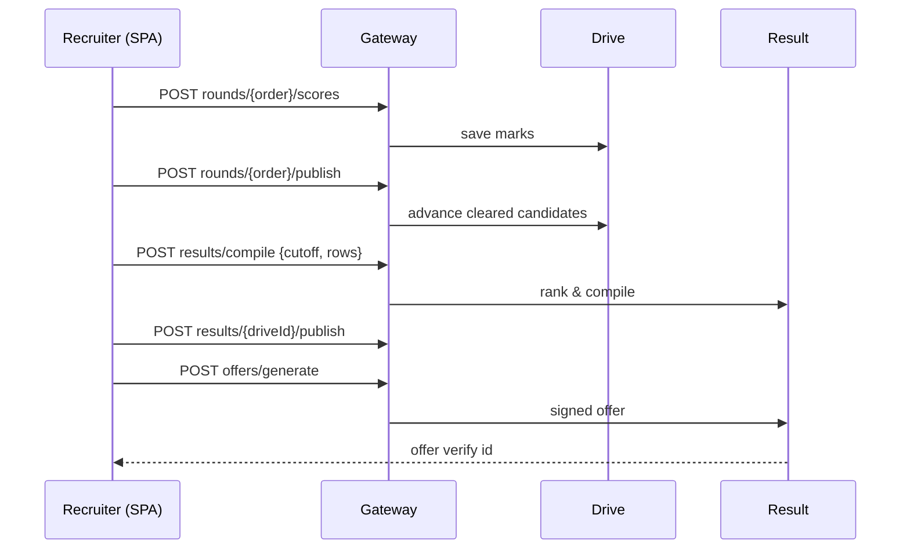
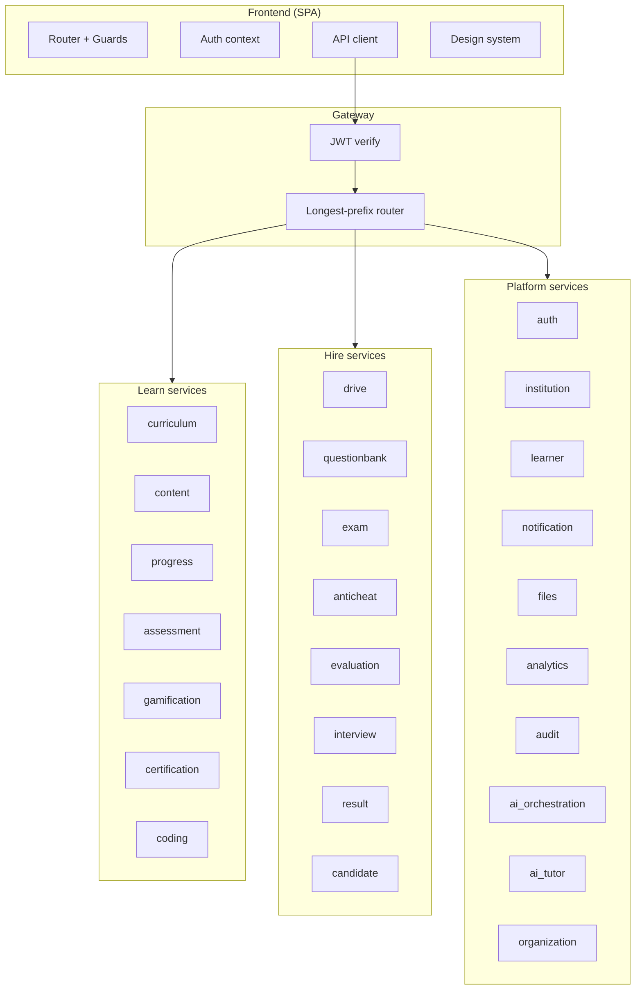
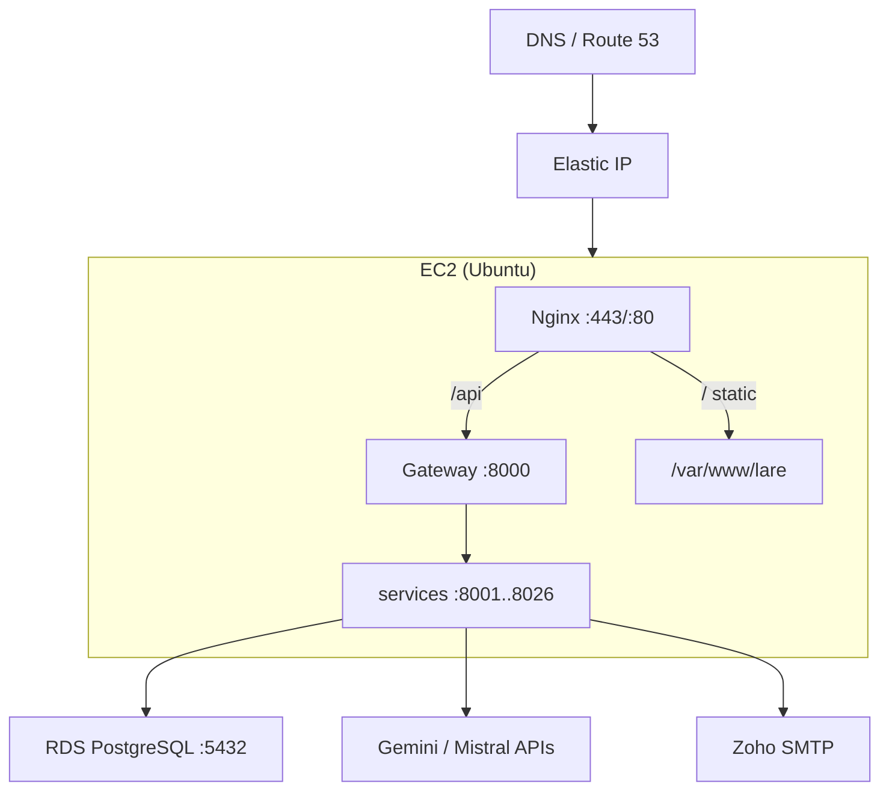

\newpage

# 1. Executive Summary

**LARE** is a single, cloud‑hosted platform that carries a person from *learning a skill* to *being hired for it*. It is delivered as **two products that share one backend**:

- **LARE Learn** (the LMS) — an AI‑assisted learning environment that teaches, tests, and certifies skills. It builds a live model of each learner (the *Cognitive Twin*), auto‑generates lesson material and coding practice, coaches the learner toward their weak areas, and issues verifiable credentials.
- **LARE Hire** (the Drive/recruitment product) — a proctored, skills‑first assessment and hiring suite. Recruiters build question banks and exams, run campus/company drives with anti‑cheat proctoring, evaluate and rank candidates, conduct structured interviews, and issue offers.

The two products are **intentionally separate in the user experience** (a student never sees the recruiter console and vice‑versa) but **share a common platform**: the same identity system, the same 26 backend microservices, the same design system, and the same PostgreSQL database (with an isolated schema per service).

This document is the complete engineering and product reference for the platform. It explains:

- **What the products are** and the problems they solve.
- **The three‑tier architecture** (presentation, application, data) and how requests flow.
- **The backend**: all 26 microservices + the API gateway, the schema‑per‑service data model, and the event bus.
- **The API architecture**: conventions, the JSON envelope, RS256 JWT authentication, gateway routing, and the full endpoint catalogue.
- **The frontend architecture**: the React/Vite single‑page app, routing, the API client, the design system, and shared components.
- **Every page and every major control** across both products (43 screens).
- **UML models**: use‑case, sequence, class, component, and deployment diagrams.
- **Security, deployment, operations, and the roadmap.**

\newpage

# 2. The Problem We Are Overcoming

Skilling and hiring are broken at the seams where they should connect. The specific problems LARE targets:

## 2.1 For learners
1. **One‑size‑fits‑all courses.** Traditional LMS platforms serve the same content to everyone regardless of what a learner already knows or struggles with. LARE builds a **Cognitive Twin** — a per‑learner skill profile derived from real assessment and coding performance — and adapts content, practice, and coaching to it.
2. **Passive video consumption ≠ skill.** Watching lectures does not build coding or aptitude ability. LARE emphasises **active practice**: coding practice with instant feedback, adaptive drills that tune difficulty in real time, and "practice worlds" (workplace simulations).
3. **No trustworthy proof of skill.** A certificate that cannot be verified is worthless to an employer. LARE issues **cryptographically signed credentials** (the Sovereign Learning Wallet) and public verification pages.
4. **Forgetting.** Skills decay. LARE's **spaced‑reinforcement** ("Keep Sharp") schedules review of exactly the topics a learner is about to forget.

## 2.2 For colleges / institutions
1. **Tool sprawl.** Separate tools for content, assessments, coding labs, certificates, and placement. LARE unifies them.
2. **No live visibility.** Administrators cannot see, at a glance, how a cohort is performing or where the weak spots are. LARE provides **live analytics** (rankings, cohort readiness, weak‑area heatmaps).
3. **Exam integrity.** Online assessments are easy to cheat. LARE adds **proctoring and anti‑cheat flags on every page where a student submits an answer**.
4. **The placement gap.** Learning and hiring are disconnected. LARE Hire is built into the same platform, so a college's learners flow directly into recruiter pipelines.

## 2.3 For startups / recruiters
1. **Resume‑based hiring is noisy.** Resumes over‑ and under‑state ability. LARE Hire evaluates **demonstrated skill** through proctored assessments and coding rounds.
2. **Slow test authoring.** Building fair question banks and papers is slow. LARE **AI‑generates** questions and coding problems with hidden test cases.
3. **Cheating at scale.** Remote assessment invites cheating. LARE's proctoring, anti‑cheat event capture, and **adversarial viva** (prove you understand your own solution) make scores trustworthy.
4. **Unstructured interviews.** LARE provides structured interview scheduling, rating, and automated evaluation/ranking.

## 2.4 The unifying thesis
> **Teach a skill, measure it honestly, prove it verifiably, and connect it to an opportunity — on one platform.**

\newpage

# 3. Product Overview

## 3.1 LARE Learn (LMS)

LARE Learn is the student‑facing learning product. Its capabilities:

| Capability | What it does |
|---|---|
| **Dashboard** | A personalised home showing the learner's real XP, level, streak, badges, and skill scorecard. |
| **My Learning** | The curriculum tree (years → modules → lessons) and a personalised content playlist. |
| **Assessments** | Take quizzes/tests; results feed the Cognitive Twin and skill scorecard. Proctored where configured. |
| **Coding Practice** | A student‑facing coding surface using the same sandbox as Drive coding rounds; feeds the Skill Map. |
| **Adaptive Drill** | A "flow" experience: questions whose difficulty tunes in real time to keep the learner in the zone. |
| **Practice Worlds** | Browser‑based workplace simulations (embodied practice). |
| **My Skill Map** | The Cognitive Twin visualised — strengths and gaps across skills. |
| **Career Readiness** | Skills‑to‑opportunity: readiness against target career roles. |
| **Keep Sharp** | Forgetting‑aware spaced review queue. |
| **Peer Mesh** | AI‑matched peer teach‑back — learn by teaching a classmate a step behind. |
| **Micro‑Lessons** | On‑demand, AI‑generated lesson material (text, code, tables, callouts, checks). |
| **AI Tutor** | A conversational tutor for DSA, aptitude, interviews, and study‑plan generation. |
| **Achievements** | XP, badges, streaks, and the leaderboard. |
| **Certificates** | View, print, download (PDF), and publicly verify issued certificates. |
| **My Wallet** | The Sovereign Learning Wallet — a signed, verifiable competence record. |
| **Profile / Settings / Notifications** | Account, preferences, and in‑app inbox. |

**Staff‑facing (within LARE Learn):**

| Console | Purpose |
|---|---|
| **Admin Console** | Colleges, learners, cohorts, and admin analytics. |
| **Curriculum Studio** | Author real curriculum + AI‑assisted lesson material. |
| **Trainer Console** | Roster, attendance, grading, and progress. |

## 3.2 LARE Hire (Drive)

LARE Hire is the recruiter/placement product. Its capabilities:

| Capability | What it does |
|---|---|
| **Drives** (candidate) | Browse and attend open drives; take exams. |
| **Matched Opportunities** | Open drives matched to a candidate's verified skills. |
| **Exam Portal** | The proctored exam‑taking experience (MCQ + coding). |
| **Recruiter Drives** | Create and manage drives (roles, eligibility, rounds, workflow). |
| **Drive Console** | Per‑drive command centre: registrations, rounds, results, interviews, analytics. |
| **Question Bank** | Author/activate questions; AI‑generate questions; build blueprints and papers. |
| **Rounds** | Round‑by‑round marks sheets; advance cleared candidates; export marks. |
| **Results** | Compile, rank, publish results; generate offers/PPOs. |
| **Interviews** | Schedule, allocate, rate, and decide interviews. |
| **Analytics** | Score distribution, coding stats, and one‑click Excel export. |

## 3.3 What we developed (delivery status)

The platform is a **complete, working application** (not a prototype). Delivered across the build:

- 26 backend microservices + gateway, running against managed PostgreSQL (RDS).
- The full React/Vite SPA serving both products with role‑based routing.
- The Cognitive Twin (assessment + coding fusion), AI Tutor, AI micro‑lesson generation, adaptive drill, practice worlds, peer mesh, spaced review, and the signed wallet.
- Proctoring/anti‑cheat hooks, coding sandbox execution, certificate issue/verify, and the recruiter drive pipeline end‑to‑end.
- A 30‑student demo dataset spanning every feature, and admin analytics.
- End‑to‑end AWS deployment (Nginx + systemd/process model + RDS + TLS).

\newpage

# 4. System Architecture (Three-Tier)

LARE is a classic **three-tier architecture**, chosen so each layer scales and is secured independently.

```
                          Internet (HTTPS/TLS)
                                  |
        +-------------------------------------------------+
 TIER 1 |  PRESENTATION                                    |
        |  React + Vite SPA  -  LARE Learn + LARE Hire     |
        |  Served by Nginx (static dist) + TLS termination |
        +----------------------------+--------------------+
                                     |  /api/... (reverse proxy)
        +----------------------------+--------------------+
 TIER 2 |  APPLICATION                                     |
        |  API Gateway (:8000) - auth + longest-prefix     |
        |  26 Flask microservices (127.0.0.1:8001..8026)   |
        |  AI Orchestration -> Gemini / Mistral            |
        |  Event bus (HTTP fan-out or Redis Streams)       |
        +----------------------------+--------------------+
                                     |  SQL (TLS)
        +----------------------------+--------------------+
 TIER 3 |  DATA                                            |
        |  PostgreSQL (Amazon RDS) - schema per service    |
        |  File/object storage - automated backups + PITR  |
        +-------------------------------------------------+
```

Mermaid (renders on GitHub / markdown viewers):



## 4.1 Why three tiers
- **Presentation** owns nothing but rendering and user interaction; it holds no secrets and talks only to `/api`.
- **Application** owns all business logic and is the only tier that touches data. It is horizontally scalable and stateless (session state lives in signed tokens, not the process).
- **Data** is a managed, backed-up store with strict network isolation (reachable only from the application tier's security group).

## 4.2 Request flow (happy path)
1. The browser loads the SPA from Nginx over HTTPS.
2. The SPA calls `/api/<service>/v1/...`; Nginx reverse-proxies `/api` to the **gateway** on `127.0.0.1:8000`.
3. The gateway **verifies the JWT**, then routes by **longest-prefix match** to the owning service (e.g. `/lms/v1/gamification/...` to the gamification service on `:8008`).
4. The service executes logic against **its own schema** in PostgreSQL, optionally emits domain events on the bus, and returns a JSON envelope.
5. Nginx streams the response back to the SPA.

## 4.3 Technology stack

| Layer | Technology |
|---|---|
| Frontend | React 18, Vite 5, React Router v6, Tailwind CSS, Framer Motion, lucide-react icons |
| API client | Fetch-based client with a `{ data, meta, errors }` envelope, JWT storage, silent refresh |
| Backend | Python 3, Flask, SQLAlchemy 2.x, Pydantic v2, Gunicorn |
| Shared library | `lare_common` (config, db, auth context, errors, events, exports, AI client) |
| Datastore | PostgreSQL 16 (Amazon RDS), schema-per-service |
| Event bus | Redis Streams (or HTTP fan-out when Redis is absent) |
| AI | Google Gemini (LARE Learn), Mistral (LARE Hire) via a common AI client |
| Auth | RS256 JWT (Auth signs; every service + gateway verify) |
| Sandbox | Subprocess or bubblewrap isolation for code execution |
| Web/serve | Nginx (static + TLS + reverse proxy); services as processes/systemd units |
| Infra | AWS EC2 + RDS; Elastic IP; Certbot TLS |

## 4.4 Deployment topology

```
DNS --- A record --- Elastic IP
                         |
                     [ EC2 ]
                     Nginx :443/:80
                       |-- / (static dist)  -> /var/www/lare
                       +-- /api -> Gateway :8000 -> services :8001..8026
                                                        |
                                                  RDS PostgreSQL :5432
```

\newpage

# 5. Backend Architecture - Microservices

The backend is **26 Flask microservices plus a gateway**. Each service:

- Owns a **single domain** and a **single PostgreSQL schema** (schema name = service name; `auth` uses `lare_auth` because `auth` is reserved).
- Is started independently (`manage.py serve`) on its own port (`8001..8026`; gateway on `8000`).
- Shares the `lare_common` library for config, database sessions, auth-context extraction, error handling, events, and document exports.
- Returns the standard JSON envelope and honours RS256 JWT verification.

## 5.1 The API Gateway (:8000)

The gateway is the single entry point. Responsibilities:

- **Authentication** - verify the RS256 JWT on protected routes; allow public prefixes (e.g. `/verify/`, auth endpoints).
- **Routing** - longest-prefix match from a `ROUTES` table to the owning service, then reverse-proxy.
- **Slow routes** - AI and code-execution endpoints are given extended timeouts (`SLOW_ROUTES`).
- **Binary passthrough** - streams PDFs and XLSX exports without mangling.

## 5.2 Service catalogue

| # | Service | Port | Domain | Responsibility |
|---|---|---|---|---|
| 1 | **auth** | 8001 | Identity | Registration, login, JWT issue/refresh, OTP, email verify, password reset, `/me`. |
| 2 | **institution** | 8002 | Identity | Colleges, cohorts, and institutional structure. |
| 3 | **learner** | 8003 | Learn | Learner profiles, enrolments, projects, skills, stream selection, imports. |
| 4 | **curriculum** | 8004 | Learn | Curricula, years, modules, lessons; lesson content authoring. |
| 5 | **content** | 8005 | Learn | Content items, personalised playlists, recommendations, content progress. |
| 6 | **progress** | 8006 | Learn | Attendance, year computation, scorecards, progress summaries. |
| 7 | **assessment** | 8007 | Learn | Assessments/attempts, the Cognitive Twin, AI coach, careers, reviews, mesh, drill, worlds, micro-lessons, wallet (the hub service). |
| 8 | **gamification** | 8008 | Learn | XP, levels, badges, streaks, leaderboard. |
| 9 | **certification** | 8009 | Learn | Certificate issue, PDF, and public verification. |
| 10 | **candidate** | 8010 | Hire | Candidate profiles, applications, resume/photo. |
| 11 | **drive** | 8011 | Hire | Drives, roles, eligibility, rounds, workflow, registrations, funnel, exports. |
| 12 | **questionbank** | 8012 | Hire | Questions, blueprints, paper generation. |
| 13 | **exam** | 8013 | Hire | Exam definitions, papers, exam sessions, save/submit. |
| 14 | **submission** | 8014 | Hire | Answer submissions and grading intake. |
| 15 | **anticheat** | 8015 | Hire | Proctoring sessions and anti-cheat event capture. |
| 16 | **coding** | 8016 | Both | Coding problems, sessions, sandbox run/submit, viva, skills aggregation. |
| 17 | **evaluation** | 8017 | Hire | Ranking, difficulty analysis, the Hire evaluation twin. |
| 18 | **interview** | 8018 | Hire | Interview scheduling, allocation, rating, decisions. |
| 19 | **result** | 8019 | Hire | Result compilation, publication, offers/PPOs. |
| 20 | **notification** | 8020 | Platform | In-app inbox, email/SMS dispatch, preferences. |
| 21 | **files** | 8021 | Platform | Pre-signed upload (request, PUT, complete), file metadata. |
| 22 | **analytics** | 8022 | Platform | Role dashboards, college rankings, readiness indices. |
| 23 | **audit** | 8023 | Platform | Append-only audit trail of significant actions. |
| 24 | **ai_orchestration** | 8024 | Platform | Central AI request orchestration and budgeting. |
| 25 | **ai_tutor** | 8025 | Platform | Conversational tutor, sessions, study-plan and advice generation. |
| 26 | **organization** | 8026 | Platform | Organisation/tenant metadata. |
| - | **gateway** | 8000 | Infra | Auth + routing + reverse proxy (front door). |

## 5.3 Schema-per-service data model

Each service `create_all`s its own tables inside its own schema. This gives:

- **Isolation** - a bug or migration in one service cannot corrupt another's tables.
- **Least privilege** - a service connects with `search_path` set to its schema.
- **Independent evolution** - new tables/columns are added per service.

Representative tables (not exhaustive):

- **lare_auth**: users, sessions/refresh tokens, OTP, email-verification, password-reset tokens.
- **assessment**: `assessments`, `assessment_items`, attempts, `skill_profile` (twin), `study_plans`, `career_roles`, `review_items`, `wallet_credentials`, `drill_sessions`, `teach_sessions`, `generated_lessons`, `practice_worlds`, `world_runs`.
- **coding**: `problems`, `coding_sessions`, `coding_vivas`.
- **curriculum**: curricula, years, modules, `lessons` (with a JSON `content` block list).
- **gamification**: learner XP/level/badge/streak records; leaderboard view.
- **drive**: `drives`, `drive_roles` (with `skills`), eligibility, rounds, registrations.
- **certification**: certificates with a readable `verify_id` (e.g. `LARE-VER-####`).

## 5.4 The event bus

Services communicate asynchronously through domain events (e.g. "badge earned", "certificate issued", "exam submitted"). The bus backend is **Redis Streams** when `REDIS_URL` is set, otherwise a synchronous **HTTP fan-out**. This decouples producers from consumers - e.g. earning a badge can trigger a notification without the gamification service knowing about email.

\newpage

# 6. Data Model (Conceptual ER)

Because every service owns its own schema, the "database" is a federation of per-service models joined logically by identifiers (learner id, candidate id, drive id) rather than by cross-schema foreign keys. The conceptual relationships:



## 6.1 Key entities

- **User** (auth) - the credential/identity. A user is a **learner** in LARE Learn and/or a **candidate** in LARE Hire.
- **Skill Profile** (assessment) - the **Cognitive Twin**: a per-learner fusion of written-assessment and coding performance into skill dimensions (communication, coding, aptitude, project).
- **Wallet Credential** (assessment) - a signed, verifiable competence record with a public `verify_id`.
- **Drive / Round / Registration** (drive) - the recruitment pipeline.
- **Exam / Exam Session** (exam) - the proctored take-flow.
- **Result / Offer** (result) - compiled ranks and issued offers/PPOs.

\newpage

# 7. API Architecture

## 7.1 Conventions

- **Base path**: the SPA calls `/api`; Nginx proxies to the gateway; the gateway routes onward. Product prefixes: `/lms/...` (LARE Learn), `/drive/...` (LARE Hire), plus `/auth`, `/ai`, `/files`, `/notify`, `/analytics`, and the public `/verify`.
- **Versioning**: every route is versioned (`/v1/`).
- **Response envelope**: all JSON responses use `{ data, meta, errors }`. The client returns `data` on success and throws a typed `ApiError(code, status, details)` on failure.
- **Idempotency & safety**: reads are `GET`; state changes are `POST`/`PUT`/`DELETE`.
- **No client caching of per-user data**: the client sends `cache: "no-store"` so a shared machine never leaks one user's data to the next.

## 7.2 Authentication & sessions

- **RS256 JWT**. The **auth** service signs tokens with a private key; the gateway and every service verify with the public key. Keys are provided as `JWT_PRIVATE_KEY_FILE` / `JWT_PUBLIC_KEY_FILE`.
- **Access + refresh tokens**. The access token is short-lived; a refresh token exchanges for a new access token. The client performs a **de-duplicated silent refresh**: a burst of 401s triggers a single refresh, and the original requests replay. A genuine `expired` refresh logs out; a transient error keeps the session (critical mid-exam).
- **Internal service-to-service** calls use a shared `INTERNAL_JWT_SECRET`.



## 7.3 Authorization

Routes are guarded by role (`require_roles`) and by subject ownership - e.g. a learner may read only their **own** gamification/scorecard; requesting another learner's id returns `403`. Recruiter/admin management routes require the appropriate staff roles.

## 7.4 Endpoint catalogue

The following is the complete client-facing endpoint surface, grouped by area. (Method is shown where not a plain `GET`.)

### 7.4.1 Auth & account
- `POST /auth/v1/register` - create an account.
- `POST /auth/v1/login` - email + password login.
- `POST /auth/v1/refresh` - exchange refresh token.
- `POST /auth/v1/password/forgot`, `POST /auth/v1/password/reset` - password reset.
- `POST /auth/v1/otp/request`, `POST /auth/v1/otp/verify` - OTP login.
- `POST /auth/v1/email/verify/request`, `POST /auth/v1/email/confirm` - email verification.
- `POST /auth/v1/logout` - revoke refresh token.
- `GET /auth/v1/me` - current user.
- `PUT /notify/v1/preferences` - notification channel prefs.

### 7.4.2 LARE Learn - learning core
- `GET /lms/v1/curricula`, `GET /lms/v1/curricula/{id}/tree` - curriculum + tree.
- `GET /lms/v1/content/playlist?learner_id=...` - personalised playlist.
- `GET /lms/v1/content/recommendations?learner_id=...` - recommendations.
- `POST /lms/v1/content/{id}/progress` - record content progress.
- `GET /lms/v1/progress/{learnerId}` - progress summary.
- `GET /lms/v1/progress/{learnerId}/scorecard` - skill scorecard.
- `GET /lms/v1/gamification/{learnerId}` - XP/level/badges/streak.
- `GET /lms/v1/gamification/leaderboard/global` - leaderboard.
- `GET /lms/v1/assessments`, `POST /lms/v1/assessments`, `GET /lms/v1/assessments/{aid}` - assessments.
- `POST /lms/v1/assessments/{aid}/attempts`, `POST /lms/v1/attempts/{attemptId}/submit` - take-flow.
- `GET /lms/v1/assessments/summary?learner_id=...` - assessment summary.

### 7.4.3 LARE Learn - Cognitive Twin, coaching, careers, reviews
- `GET /lms/v1/assessments/twin/{learnerId}` - the LMS Cognitive Twin.
- `GET /lms/v1/assessments/coach/{learnerId}` (`?force=1` regenerates) - AI study plan.
- `POST /lms/v1/assessments/coach/{learnerId}/progress` - mark a plan day done.
- `POST /lms/v1/assessments/nudge/{learnerId}` - send the weakest-area nudge.
- `GET /lms/v1/careers`, `POST /lms/v1/careers`, `DELETE /lms/v1/careers/{cid}` - career roles.
- `GET /lms/v1/careers/readiness/{learnerId}` - readiness against roles.
- `GET /lms/v1/reviews/{learnerId}`, `POST /lms/v1/reviews/{learnerId}/review` - spaced review.
- `POST /lms/v1/reviews/{learnerId}/activity` - record real practice into the schedule.

### 7.4.4 LARE Learn - practice, drill, worlds, mesh, lessons, wallet
- `GET /lms/v1/practice/problems`, `POST /lms/v1/practice/session`, `POST /lms/v1/practice/{sid}/run`, `POST /lms/v1/practice/{sid}/submit` - coding practice.
- `GET /lms/v1/practice/skills/{learnerId}` - practice-derived skills.
- `POST /lms/v1/practice/{sid}/viva`, `POST /lms/v1/practice/viva/{vivaId}` - adversarial viva.
- `POST /lms/v1/drill/start`, `POST /lms/v1/drill/{drillId}/answer` - adaptive drill.
- `GET /lms/v1/worlds`, `POST /lms/v1/worlds/{worldId}/start`, `POST /lms/v1/worlds/runs/{runId}/answer` - practice worlds.
- `GET /lms/v1/mesh/{learnerId}`, `GET /lms/v1/mesh/{learnerId}/sessions`, `POST /lms/v1/mesh/request`, `POST /lms/v1/mesh/{sessionId}/respond`, `POST /lms/v1/mesh/{sessionId}/complete` - peer mesh.
- `POST /lms/v1/micro-lessons/{learnerId}/generate`, `GET /lms/v1/micro-lessons/{learnerId}`, `POST /lms/v1/micro-lessons/author-blocks` - AI micro-lessons.
- `GET /lms/v1/wallet/{learnerId}`, `POST .../issue`, `POST .../revoke`, `GET .../export.pdf`, `GET /verify/wallet/{verifyId}` - the wallet.

### 7.4.5 LARE Learn - authoring & staff
- `GET/POST /lms/v1/colleges`, `GET/POST /lms/v1/colleges/{cid}/cohorts` - institutions.
- `GET/POST /lms/v1/learners`, `POST /lms/v1/learners/import`, `POST /lms/v1/learners/{lid}/verify`, `POST /lms/v1/learners/{lid}/promote` - roster.
- `POST /lms/v1/curricula`, `.../years`, `.../modules`, `.../lessons`, `GET /lms/v1/lessons/{lid}`, `PUT /lms/v1/lessons/{lid}/content`, `POST /lms/v1/lessons/{lid}/check`, `POST /lms/v1/curricula/{cid}/publish` - curriculum authoring.
- `POST /lms/v1/attendance`, `POST /lms/v1/progress/compute-year`, `POST /lms/v1/answers/{answerId}/grade` - trainer progress.
- `GET/POST /lms/v1/certificates/...`, `GET /lms/v1/certificates/{id}/pdf`, `GET /verify/{verifyId}` - certification.

### 7.4.6 LARE Hire - candidate & drives
- `GET /drive/v1/drives`, `GET /drive/v1/drives/{id}` - browse drives.
- `POST /drive/v1/attend`, `POST /drive/v1/attend/resume` - public attend flow (no login).
- `POST /drive/v1/candidate/apply`, `GET /drive/v1/candidate/applications`, `GET/PUT /drive/v1/candidate/profile` - candidate.
- `GET /drive/v1/opportunities?candidate_id=...` - matched opportunities.
- `GET /drive/v1/evaluations/twin/{candidateId}` - the Hire evaluation twin.

### 7.4.7 LARE Hire - exam take-flow & proctoring
- `GET /drive/v1/exams`, `GET /drive/v1/exams/{examId}`, `GET /drive/v1/exams/{examId}/paper` - exam meta/paper.
- `POST /drive/v1/exams/{examId}/start`, `GET /drive/v1/exam-sessions/{sid}/state`, `POST .../save`, `POST .../submit` - session flow.
- `POST /drive/v1/proctor/start`, `POST /drive/v1/proctor/{examSessionId}/events` - proctoring.
- `POST /drive/v1/coding/run-adhoc`, `GET /drive/v1/coding/languages`, `POST /drive/v1/coding/session`, `POST .../run`, `POST .../submit` - coding rounds.

### 7.4.8 LARE Hire - recruiter management
- `POST /drive/v1/drives`, `DELETE /drive/v1/drives/{id}`, `.../roles`, `.../eligibility`, `.../rounds`, `GET/PUT .../workflow` - drive setup.
- `GET .../rounds/{order}/scores`, `POST .../scores`, `POST .../candidates`, `DELETE .../candidates/{cid}`, `POST .../publish` - rounds.
- `GET .../rounds/{order}/export` - marks .xlsx export.
- `POST .../register`, `POST .../shortlist`, `POST .../advance`, `GET .../funnel`, `GET .../registrations`, `GET .../analytics` - pipeline.
- `POST /drive/v1/interviews/schedule`, `.../allocate`, `.../rate`, `.../decision`, `GET /drive/v1/interviews/drive/{driveId}` - interviews.
- `POST /drive/v1/evaluations/rank`, `GET .../exam/{examId}/ranks`, `GET .../exam/{examId}/difficulty` - evaluation.
- `POST /drive/v1/results/compile`, `GET /drive/v1/results/{driveId}`, `POST .../publish`, `POST /drive/v1/offers/generate`, `POST /drive/v1/offers/{offerId}/status` - results & offers.
- `POST /drive/v1/questions`, `GET /drive/v1/questions`, `POST .../activate`, `POST /drive/v1/blueprints`, `POST .../generate-paper`, `POST /drive/v1/exams`, `POST /drive/v1/questions/generate` (AI) - question bank.

### 7.4.9 Platform
- `GET /analytics/v1/dashboard/{role}`, `GET /analytics/v1/colleges/ranking` - analytics.
- `GET /notify/v1/inbox`, `POST /notify/v1/inbox/{id}/read` - notifications.
- `POST /files/v1/upload-url`, `PUT /files/v1/upload/{token}`, `POST /files/v1/{fileId}/complete` - pre-signed upload.
- `POST /ai/v1/tutor/chat`, `GET /ai/v1/tutor/sessions`, `GET /ai/v1/tutor/sessions/{sid}/messages`, `POST /ai/v1/tutor/study-plan`, `POST /ai/v1/tutor/stream-advice` - AI tutor.

\newpage

# 8. Frontend Architecture

## 8.1 Overview

The frontend is a **single-page application (SPA)** built with **React 18 + Vite**. It serves **both products** from one bundle, with routing and navigation that keep LARE Learn and LARE Hire separate.



## 8.2 Routing & guards

- **React Router v6** with route specificity: public routes (`/`, `/login`, `/register`, `/forgot-password`, `/drive/attend`, `/verify/...`), an app chooser (`/apps`), and product route groups (`/lms/...`, `/drive/...`).
- **Guards**: `Protected` (must be logged in), `lms(...)`/`drive(...)` (product wrappers with the AppShell), and `lmsStaff(...)`/`driveStaff(...)` (staff-only consoles). Wrong-role or logged-out users are redirected.
- **Public verify pages** are intentionally unauthenticated so an employer can verify a certificate or wallet without an account.

## 8.3 The API client (`lib/api.js`)

- A single `request(path, opts)` wrapper over `fetch` that adds the JWT, sets `cache: "no-store"`, unwraps the `{ data }` envelope, and throws a typed `ApiError` on failure.
- **Silent refresh**: on `401`, a de-duplicated refresh runs once and the request replays. Binary/raw downloads also benefit from refresh (so exports do not fail mid-session).
- **`withFallback(promise, fallback)`**: renders a graceful state if a call fails. In **development** it returns demo data so screens render with the backend down; in a **production build it blanks the fallback to an empty, same-shape state**, so the deployed app never shows fabricated or another user's data.
- `api` is a flat object of named methods, one per endpoint (the catalogue in section 7).

## 8.4 Authentication context (`lib/auth.jsx`)

Holds the current `user` (from `/auth/v1/me`) and the tokens (in `localStorage`). Exposes `useAuth()` so any page can read `user` (id, full_name, email, roles). Pages derive `learnerId = user?.id` and pass it to per-user calls.

## 8.5 Design system

Two shared modules provide a consistent, themeable UI:

- **`components/ui/primitives.jsx`** - the building blocks: `Card`, `Button` (variants: primary, secondary, ghost, amber; supports `as={Link}`), `Badge` (tone: brand/teal/amber/rose/slate), `Input`, `Field`, `XPBar`, `StatTile`.
- **`components/ui/states.jsx`** - `PageHeader`, `Loading`, `DataSource` (a live/demo indicator), and empty/error states.
- **`components/ui/Logo.jsx`** - the LARE brand mark.

Design language: a navy + gold brand palette, a display + body type pairing, generous spacing, rounded cards, and Framer Motion for subtle animation (XP bars, reveals).

## 8.6 Shared components

- **`layout/AppShell.jsx`** - the authenticated shell: top bar, the product sidebar navigation (internally scrollable via `.sidebar-scroll`), and the routed page area. The sidebar lists exactly the pages for the active product/role.
- **`ProctorBanner.jsx`** - the proctoring/integrity banner + hooks shown on every page where a student submits an answer (assessments, coding, drill, worlds, exam). It surfaces integrity flags and reports proctor events.
- **`LessonBlocks.jsx`** - renders AI-generated lesson content blocks: headings, rich text, code blocks, tables, callouts, and interactive "checks" (mini-questions graded inline).
- **`lib/markdown.js`** - a lightweight markdown renderer for tutor/lesson text.
- **`lib/certificate.js`** - certificate rendering/printing/PDF helpers.

## 8.7 Frontend build & serving

- `npm run build` (Vite) produces a hashed bundle in `frontend/dist`.
- The bundle is published to the Nginx web root (`/var/www/lare`) and served as static files; `/api` is reverse-proxied to the gateway.
- Cache-busting is automatic via content-hashed filenames (`index-<hash>.js`).

\newpage

# 9. Page-by-Page Walkthrough

This section documents **every screen** in the application: its route, purpose, the elements and controls on it, the actions its buttons perform, and the data it reads/writes. Screens are grouped by area.

## 9.A Public & Authentication

### 9.A.1 Landing (`/`)
- **Purpose**: marketing entry point introducing LARE Learn and LARE Hire.
- **Elements**: hero headline + tagline, product highlights, calls to action.
- **Buttons**: **Log in** (to `/login`), **Get started / Register** (to `/register`).

### 9.A.2 Login (`/login`)
- **Purpose**: email + password sign-in.
- **Elements**: email field, password field, "remember", error banner.
- **Buttons**: **Sign in** (calls `POST /auth/v1/login`, stores tokens, redirects to `/apps`), **Forgot password?** (to `/forgot-password`), **Create account** (to `/register`). OTP login path where enabled.
- **Data**: `api.login`, then `api.me`.

### 9.A.3 Register (`/register`)
- **Purpose**: create an account.
- **Elements**: full name, email, password (+ confirm), validation messages.
- **Buttons**: **Create account** (`POST /auth/v1/register`), then email verification prompt (`api.requestEmailVerify`).

### 9.A.4 Forgot Password (`/forgot-password`)
- **Purpose**: request a reset link / reset with token.
- **Buttons**: **Send reset link** (`api.forgotPassword`), **Reset password** (`api.resetPassword`).

### 9.A.5 Auth Layout (component)
- Shared split-screen frame for the auth pages (brand panel + form panel).

### 9.A.6 App Chooser (`/apps`)
- **Purpose**: after login, choose the product to enter (LARE Learn or LARE Hire), filtered by the user's roles.
- **Buttons**: **Enter LARE Learn** (`/lms`), **Enter LARE Hire** (`/drive`).

### 9.A.7 Attend Drive (`/drive/attend`)
- **Purpose**: public, **no-login** drive attendance for walk-in campus drives.
- **Elements**: drive code / student details form; resume-by-id.
- **Buttons**: **Attend** (`api.attendDrive` -> returns a scoped student session), **Resume** (`api.attendResume`).

### 9.A.8 Wallet Verify (`/verify/wallet/:verifyId`)
- **Purpose**: public verification of a Sovereign Learning Wallet credential.
- **Elements**: signature-verified status, subject name, issued date, competence claims.
- **Data**: `api.verifyWallet(verifyId)` (public, no auth).

### 9.A.9 Certificate Verify (`/verify/:verifyId`)
- **Purpose**: public certificate verification page. Accepts a readable id (e.g. `LARE-VER-####`).
- **Elements**: verify-id input, verified certificate render (holder name, issued date, credential).
- **Buttons**: **Verify** (`api.verifyCertificate(verifyId)`), which opens the certificate.

## 9.B LARE Learn - Student

### 9.B.1 Dashboard (`/lms`)
- **Purpose**: the learner's personalised home. **All values are the logged-in learner's real data** (no hard-coded content).
- **Elements**:
  - **Hero**: Level badge, greeting ("Welcome" for new users, "Keep it up" for active), and an **XP bar** (`total_xp` toward `next_level_at`).
  - **Stat tiles**: Current streak (+ best), Total XP, Badges count, Level.
  - **Skill scorecard**: animated bars for Communication, Coding, Aptitude, Project (real percentages; empty state for new users).
  - **Recent badges**: earned badges, or an encouraging empty state.
  - **Up next**: a card linking into learning.
- **Buttons**: **Start/Continue learning** and **Go to My Learning** (to `/lms/learning`).
- **Data**: `api.game(user.id)`, `api.scorecard(user.id)` with honest zero fallbacks.

### 9.B.2 My Learning (`/lms/learning`)
- **Purpose**: the curriculum and the learner's personalised content playlist.
- **Elements**: curriculum tree (years -> modules -> lessons), the playlist (video/reading/interactive items with lock/complete/in-progress states), progress indicators.
- **Buttons**: open a content item, resume, mark complete (writes `api.contentProgress`).
- **Data**: `api.curricula` + `api.curriculumTree`, `api.playlist(user.id)`.

### 9.B.3 Assessments (`/lms/assessments`)
- **Purpose**: browse and take assessments; results feed the twin.
- **Elements**: list of assessments (title, pass %, duration), the take-flow (items, options, timer), a **ProctorBanner** while answering.
- **Buttons**: **Start** (`api.startAttempt`), **Submit** (`api.submitAttempt`).
- **Data**: `api.listAssessments`, `api.getAssessment`.

### 9.B.4 Coding Practice (`/lms/practice`)
- **Purpose**: student-facing coding practice on the same sandbox as Drive.
- **Elements**: problem list (by skill/difficulty), code editor, language selector, sample cases, run output, verdict; **ProctorBanner** on submit.
- **Buttons**: **Open** (`api.practiceOpen`), **Run** (`api.practiceRun`), **Submit** (`api.practiceSubmit`), **Start viva** (`api.vivaStart`).
- **Data**: `api.practiceProblems`, `api.practiceSkills(user.id)`.

### 9.B.5 Coding IDE (component/page)
- **Purpose**: the reusable code editor used by practice and coding rounds - editor, language dropdown, run/submit, test-case results panel, starter templates per language.

### 9.B.6 Adaptive Drill (`/lms/drill`)
- **Purpose**: a "flow" drill whose difficulty tunes in real time.
- **Elements**: topic/target selector, one question at a time, live difficulty/level indicator, streak, timing; **ProctorBanner**.
- **Buttons**: **Start drill** (`api.drillStart`), **Answer** (`api.drillAnswer` with elapsed time).

### 9.B.7 Practice Worlds (`/lms/worlds`)
- **Purpose**: browser-based workplace simulations (embodied practice).
- **Elements**: world catalogue (role/skill/difficulty), stepped scenario runner, score/pass indicator; **ProctorBanner** on answer.
- **Buttons**: **Start** (`api.startWorld`), **Answer step** (`api.answerWorld`).

### 9.B.8 My Skill Map (`/lms/skill-map`)
- **Purpose**: the Cognitive Twin visualised - strengths and gaps.
- **Elements**: skill dimensions with mastery, sources (written vs coding), weakest-area highlights.
- **Data**: `api.skillTwin(user.id)`, `api.practiceSkills(user.id)`.

### 9.B.9 Career Readiness (`/lms/careers`)
- **Purpose**: Skills-to-Opportunity - readiness against target career roles.
- **Elements**: role cards with required-skills coverage, gap list, readiness percentage.
- **Data**: `api.listCareers`, `api.careerReadiness(user.id)`.

### 9.B.10 Keep Sharp (`/lms/keep-sharp`)
- **Purpose**: forgetting-aware spaced review queue.
- **Elements**: due items (skill, last mastery, interval), review prompts.
- **Buttons**: **Review** (`api.submitReview` with outcome), which reschedules via spaced repetition.
- **Data**: `api.reviewQueue(user.id)`.

### 9.B.11 Peer Mesh (`/lms/mesh`)
- **Purpose**: AI-matched peer teach-back (learn by teaching).
- **Elements**: "Get help from a peer" (mentors per weak topic), "You could teach" (topics you have mastered where peers need help), incoming requests, active teach-backs.
- **Buttons**: **Ask** (per mentor -> `api.meshRequest`; marks only that mentor "requested"), **Accept/Decline** (`api.meshRespond`), **Mark done** (`api.meshComplete`).
- **Data**: `api.meshOverview(user.id)`, `api.meshSessions(user.id)`.

### 9.B.12 Micro-Lessons (`/lms/lessons`) & Lesson Viewer (`/lms/lesson/:lid`)
- **Purpose**: on-demand AI-generated lessons and the reader.
- **Elements (Lessons)**: generate-by-topic input, list of the learner's generated lessons.
- **Buttons**: **Generate** (`api.generateLesson`), open a lesson.
- **Elements (Viewer)**: rendered **LessonBlocks** - headings, rich text, code blocks, tables, callouts, and inline **checks** (mini-questions graded via `api.gradeLessonCheck`, which also records practice into the review schedule).

### 9.B.13 Achievements (`/lms/achievements`)
- **Purpose**: XP, badges, streaks, and the leaderboard.
- **Elements**: level hero (level, total XP, XP bar, streak), stat tiles, skill scorecard, badges grid, leaderboard.
- **Data**: `api.game(user.id)`, `api.scorecard(user.id)`, `api.leaderboard` (empty fallbacks - never demo numbers).

### 9.B.14 AI Tutor (`/lms/tutor`)
- **Purpose**: conversational tutor for DSA, aptitude, interviews, and study plans.
- **Elements**: chat thread, message input, session list; study-plan generator.
- **Buttons**: **Send** (`api.tutorChat`), **Generate study plan** (`api.studyPlan`), open past sessions (`api.tutorSessions`, `api.tutorMessages`).

### 9.B.15 Certificates (`/lms/certificates`)
- **Purpose**: view, print, download, and verify certificates.
- **Elements**: issued-certificate list; a **viewer modal** rendering the certificate.
- **Buttons**: **View** (opens modal), **Print** (browser print of the certificate), **Download PDF** (`api.downloadCertificatePdf`), **Verify certificate** (opens the public verify page with the readable id).
- **Data**: `api.certificates(user.id)`.

### 9.B.16 My Wallet (`/lms/wallet`)
- **Purpose**: the Sovereign Learning Wallet - a signed, verifiable competence record.
- **Elements**: credential summary, signature status, verify id/QR.
- **Buttons**: **Issue** (`api.issueWallet`), **Revoke** (`api.revokeWallet`), **Download PDF** (`api.downloadWalletPdf`), **Public verify link** (`/verify/wallet/:id`).
- **Data**: `api.getWallet(user.id)`.

### 9.B.17 Profile (`/lms/profile`, `/drive/profile`)
- **Purpose**: the recruitment/portfolio profile. **Shows the logged-in user's own data**; on a failed load it seeds from the user's own identity (never another person).
- **Elements**: editable details (name, email, phone, branch, CGPA), education, projects, skills, contact, profile-completeness bar, resume/photo upload.
- **Buttons**: **Save changes** (`api.updateProfile`; shows a real error on failure), **Upload resume/photo** (3-step pre-signed upload).

### 9.B.18 Notifications (`/lms/notifications`, `/drive/notifications`)
- **Purpose**: in-app inbox.
- **Elements**: message list (subject, body, read/unread, time).
- **Buttons**: **Mark read** (`api.markRead`). **Data**: `api.inbox`.

### 9.B.19 Settings (`/lms/settings`, `/drive/settings`)
- **Purpose**: account and notification preferences.
- **Buttons**: toggle channels (`api.setNotifyPref`), account actions.

\newpage

## 9.C LARE Learn - Staff Consoles

### 9.C.1 Admin Console (`/lms/admin`)
- **Purpose**: college/organisation administration and admin analytics.
- **Elements**: KPI tiles (colleges, learners, drives), top-college readiness ranking, colleges table, learners table with filters.
- **Buttons**: **Create college** (`api.createCollege`), manage cohorts (`api.collegeCohorts`, `api.createCohort`), open learner detail.
- **Data**: `api.dashboard("college_admin")`, `api.colleges`, `api.learners`.

### 9.C.2 Curriculum Studio (`/lms/curriculum`)
- **Purpose**: author **real** curriculum + AI-assisted lesson material (not just titles).
- **Elements**: loads the real curriculum tree; editors for years, modules, lessons; a lesson content editor that builds a block list (text, code, tables, callouts, checks).
- **Buttons**: **Add year/module/lesson** (`api.addYear/addModule/addLesson`), **AI-generate blocks** (`api.authorBlocks(topic)` -> review and insert), **Save lesson content** (`api.setLessonContent`), **Publish curriculum** (`api.publishCurriculum`).

### 9.C.3 Lesson Editor (component)
- The lesson content editor used by Curriculum Studio: add/reorder/edit blocks, AI-generate a comprehensive lesson (tables, code, examples, callouts, checks), preview, and save into the lesson's JSON `content`.

### 9.C.4 Trainer Console (`/lms/trainer`)
- **Purpose**: roster, attendance, grading, and progress.
- **Elements**: learner roster, attendance capture, answer-grading queue, year-computation controls.
- **Buttons**: **Mark attendance** (`api.markAttendance`), **Grade answer** (`api.gradeAnswer`), **Compute year** (`api.computeYear`), **Verify/Promote learner** (`api.verifyLearner`, `api.promoteLearner`).
- **Data**: `api.learners`.

## 9.D LARE Hire - Candidate

### 9.D.1 Drives (`/drive`)
- **Purpose**: browse open drives and attend.
- **Elements**: drive cards (company, title, venue, reporting time, status).
- **Buttons**: **View** (`api.drive(id)`), **Apply** (`api.apply`).
- **Data**: `api.drives("open")`.

### 9.D.2 Matched Opportunities (`/drive/opportunities`)
- **Purpose**: open drives matched to the candidate's verified skills (Skills-to-Opportunity for Hire).
- **Elements**: matched drive/role cards with skill-match indicators.
- **Data**: `api.matchedOpportunities(candidateId)`.

### 9.D.3 Exam Portal (`/drive/test/:examId`)
- **Purpose**: the proctored exam-taking experience.
- **Elements**: exam meta/instructions, the paper (MCQ + coding items), timer, question navigator, autosave, a persistent **ProctorBanner** with anti-cheat hooks (tab/focus/visibility events reported to the anticheat service).
- **Buttons**: **Start** (`api.examStart`), per-item save (`api.examSave`), **Submit** (`api.examSubmit`). Coding items use the Coding IDE (`api.codingOpen/Run/Submit`).
- **Data**: `api.examMeta`, `api.examPaper`, `api.examState`; proctoring via `api.proctorStart`, `api.proctorEvent`.

## 9.E LARE Hire - Recruiter

### 9.E.1 Recruiter Drives (`/drive/recruiter/drives`)
- **Purpose**: list and create drives.
- **Elements**: drive list (status, venue), create form.
- **Buttons**: **Create drive** (`api.createDrive`), open a drive (`/drive/recruiter/drives/:id`), delete (`api.deleteDrive`).
- **Data**: `api.drives()`.

### 9.E.2 Drive Console (`/drive/recruiter/drives/:id`)
- **Purpose**: the per-drive command centre. A tabbed console composing the following tabs, plus the drive header (company, title, status, funnel).
- **Header/overview**: funnel counts (`api.funnel`), open-drive control (`api.openDrive`), roles/eligibility/rounds/workflow setup.
- **Buttons**: **Add role** (`api.addRole`), **Set eligibility** (`api.setEligibility`), **Add round** (`api.addRound`), **Edit workflow** (`api.getWorkflow`/`api.setWorkflow`), **PPO config** (`api.setPpo`), **Open drive**.
- **Data**: `api.drive(id)`, `api.funnel(id)`, `api.driveRegistrations(id)`.

### 9.E.3 Rounds Tab (within Drive Console)
- **Purpose**: round-by-round marks sheets and progression.
- **Elements**: round selector, editable marks table (Round 1 auto-seeded from applicants; later rounds panel-scored), candidate search/filter, skills popover, add/remove candidate.
- **Buttons**: **Save score** (`api.setRoundScore`), **Add candidate** (`api.addRoundCandidate`), **Remove candidate** (`api.removeRoundCandidate`), **Publish round** (`api.publishRound`; cleared candidates advance), **Delete round** (`api.deleteRound`), **Download all / Download cleared** (`api.downloadRoundXlsx` -> .xlsx; now resilient to token expiry).

### 9.E.4 Results Tab (within Drive Console)
- **Purpose**: compile, publish, and turn results into offers.
- **Elements**: cutoff input, per-candidate final-score inputs, results table (rank, candidate, score, outcome, offer), publish state.
- **Buttons**: **Compile** (`api.compileResults` -> `api.driveResults`; shows a real error on failure - no fabricated results), **Publish results** (`api.publishResults`), **PPO offer / Offer** (`api.generateOffer`), offer verify link (`/verify/offer/:id`).

### 9.E.5 Interviews Tab (within Drive Console)
- **Purpose**: schedule and run interviews.
- **Elements**: interview list (candidate, stage, mode, status, rating, decision).
- **Buttons**: **Schedule** (`api.scheduleInterview`), **Allocate** (`api.allocateInterview`), **Rate** (`api.rateInterview`), **Decide** (`api.decideInterview`).
- **Data**: `api.driveInterviews(id)`.

### 9.E.6 Analytics Tab (within Drive Console)
- **Purpose**: drive analytics with Excel export.
- **Elements**: score distribution, coding stats, funnel; export controls.
- **Buttons**: **Download attendees / Download cleared** (`api.downloadRoundXlsx`), **Refresh** (`api.driveAnalytics`).

### 9.E.7 Question Bank (`/drive/recruiter/questions`)
- **Purpose**: author and manage questions; build papers.
- **Elements**: question list (type, category, difficulty, status, version), authoring form, AI generation, blueprint builder, drive selector.
- **Buttons**: **Create question** (`api.createQuestion`), **Activate** (`api.activateQuestion`), **AI-generate questions** (`api.generateQuestions`), **Create blueprint** (`api.createBlueprint`), **Generate paper** (`api.generatePaper`), **Create exam** (`api.createExam`), **Upsert eval key** (`api.upsertEvalKey`).
- **Data**: `api.listQuestions`, `api.drives()`.

\newpage

# 10. UML Models

## 10.1 Actors

| Actor | Product | Description |
|---|---|---|
| **Student / Learner** | Learn | Learns, practices, takes assessments, earns credentials. |
| **Trainer** | Learn | Authors progress, attendance, grading. |
| **College Admin** | Learn | Manages colleges, cohorts, learners; views analytics. |
| **Super Admin** | Both | Platform-wide administration. |
| **Candidate** | Hire | Applies to drives, takes exams/interviews. |
| **Recruiter** | Hire | Builds drives, question banks, evaluates and hires. |
| **Interviewer** | Hire | Rates and decides interviews. |
| **Employer / Verifier** | Public | Verifies a certificate or wallet without an account. |

## 10.2 Use-case diagram



## 10.3 Selected use-case descriptions

**UC14 - Take a proctored exam**
- **Actor**: Candidate. **Pre**: registered/eligible for a drive with an exam. **Main flow**: start exam -> proctoring session begins -> answer MCQ/coding items with autosave -> anti-cheat events captured -> submit -> auto/queued evaluation. **Post**: an exam session with answers and integrity flags exists. **Alt**: token expiry mid-exam is transparently refreshed; network blips keep the session.

**UC17 - Compile results and issue an offer**
- **Actor**: Recruiter. **Pre**: rounds scored. **Main flow**: enter final scores -> set cutoff -> compile (server ranks) -> review -> publish -> generate offer/PPO -> candidate/verifier can view a signed offer. **Exceptions**: on server error, a clear message is shown (no fabricated results).

**UC9 - Earn a verifiable credential**
- **Actor**: Student. **Main flow**: complete requirements -> certificate issued with a readable `verify_id` -> student views/prints/downloads PDF -> anyone verifies publicly. The Sovereign Wallet packages competence claims, signs them, and exposes a public verify page.

## 10.4 Sequence - Proctored exam



## 10.5 Sequence - AI micro-lesson generation



## 10.6 Sequence - Drive round to result to offer



## 10.7 Class diagram (key domain)


## 10.8 Component diagram



## 10.9 Deployment diagram



\newpage

# 11. Feature Deep-Dives

## 11.1 The Cognitive Twin
A per-learner **skill profile** fused from two evidence streams: **written assessments** and **coding performance**. It maps activity onto four dimensions (communication, coding, aptitude, project) and identifies the **weakest area**, which drives the coach, reviews, and micro-lessons. LARE Hire has an analogous **evaluation twin** built from real drive-exam performance.

## 11.2 Persistent AI coach + nudging
The coach generates a **study plan** targeting the weakest area, persists it, tracks day-by-day completion, and can **nudge** the learner (in-app + email) with their plan. Regeneration is available on demand.

## 11.3 AI micro-lessons (Generative Learning Fabric)
On-demand lessons are generated as a **block list** (headings, rich text, code, tables, callouts, and inline checks). To keep code and tables intact, generation uses a **marker format + deterministic parser** rather than fragile strict-JSON; transient provider errors retry and never persist a generic template. The same block format powers the **Curriculum Studio** authoring experience.

## 11.4 Adaptive drill (Flow layer)
A drill that serves one question at a time and **tunes difficulty in real time** from correctness and speed, keeping the learner in a productive "flow" band.

## 11.5 Practice Worlds (Embodied Practice)
Stepped, browser-based workplace simulations with a pass threshold - practicing skills in a realistic scenario rather than isolated questions.

## 11.6 Peer Mesh (Human Knowledge Mesh)
The twin knows who just mastered a topic and who is a step behind, and pairs them for **peer teach-back** (learning by teaching). The seeker initiates; the mentor accepts; both mark completion. Requests are tracked **per mentor**.

## 11.7 Adversarial viva
After a coding submission, the learner must answer AI-generated questions about **their own** solution - a cheat-resistant check that they understand what they submitted.

## 11.8 Sovereign Learning Wallet
A signed, verifiable competence record. Signed with a wallet key (HS256 over the platform secret), it exposes a **public verify page** so an employer can confirm authenticity without an account. Certificates use readable ids (e.g. `LARE-VER-####`).

## 11.9 Proctoring & anti-cheat
Every page where a student submits an answer shows a **ProctorBanner** and reports integrity events (focus/tab/visibility) to the anticheat service, which flags anomalies for the exam session.

\newpage

# 12. Security & Compliance

| Control | Implementation |
|---|---|
| **Identity** | RS256 JWT: the auth service signs; the gateway + every service verify with the public key. Access + refresh tokens with de-duplicated silent refresh. |
| **Authorization** | Role guards (`require_roles`) + subject-ownership checks (a learner reads only their own data; cross-user ids return 403). |
| **Transport** | TLS/HTTPS end-to-end (Certbot). The SPA calls only `/api`; services bind to `127.0.0.1`. |
| **Data isolation** | One PostgreSQL schema per service; least-privilege `search_path`. |
| **No cross-user leakage** | The API client sends `cache: "no-store"`; production builds never render demo/fallback data (empty states instead), preventing one user's shape from showing to another. |
| **Exam integrity** | Proctoring + anti-cheat event capture on every answer-submission page; adversarial viva for coding. |
| **Audit** | Append-only audit trail of significant actions. |
| **Backups / DR** | RDS automated backups + point-in-time recovery. |
| **Secrets** | Kept in gitignored env files / key files; never committed. Rotate DB, JWT, AI, and SMTP secrets on schedule. |
| **Sandbox** | Code execution runs under subprocess/bubblewrap isolation. |

# 13. Deployment & Operations

## 13.1 Model
- **One EC2 box** runs Nginx + the gateway + all 26 services (as processes/systemd units); **RDS** hosts PostgreSQL. The SPA is built to static files and served by Nginx; `/api` reverse-proxies to the gateway.
- Scale later by moving Redis to ElastiCache and putting multiple EC2 app boxes behind a load balancer (services are stateless).

## 13.2 First-time setup (summary)
1. Provision RDS (PostgreSQL 16) and EC2 (Ubuntu), same VPC; lock RDS to the EC2 security group.
2. Install packages (Python, Node, Nginx, Redis optional, Postgres client, bubblewrap).
3. Clone the repo; create a Python venv; `pip install` base + per-service requirements + the editable `libs/` (`lare_common`).
4. Generate RS256 keys; fill `/backend/.env` (DATABASE_URL, JWT key files, AI keys, SMTP).
5. `init-db` per service (creates schemas/tables); apply column migrations.
6. Build the SPA and publish `dist` to the Nginx web root.
7. Configure Nginx (static + `/api` proxy) and TLS (Certbot).
8. Start all services; verify `/health`.

## 13.3 Redeploy after code changes
The repo ships `redeploy.sh` (pull -> restart backend -> rebuild + publish SPA):
- `./redeploy.sh` - full redeploy.
- `FRONTEND_ONLY=1 ./redeploy.sh` - UI-only change (build + publish + reload Nginx).
- `BACKEND_ONLY=1 ./redeploy.sh` - server-only change (restart services).
- `DEPS=1 ./redeploy.sh` - when dependencies changed (runs installs). `npm ci` also runs automatically if `node_modules` is missing.
Publishing copies the built `dist` into the Nginx web root (e.g. `/var/www/lare`) - building alone does not update what Nginx serves.

## 13.4 Operational notes learned in production
- **Python 3.14 compatibility**: pins for `psycopg`, `pydantic`, and `SQLAlchemy` were relaxed to versions shipping 3.14 wheels.
- **Low-RAM build**: add swap so the Vite build is not OOM-killed; build the SPA before starting the 26 services when RAM is tight.
- **Disk**: keep headroom for the venv + node build; grow the EBS volume rather than deleting OS files.
- **Binary downloads**: exports/PDFs refresh the token like any other call, so they survive an access-token expiry mid-session.

# 14. Roadmap - How to Extend

```
1) Scale storage       -> grow the disk (EBS) for content, media, logs
2) Enable code exec    -> add the coding sandbox (bubblewrap + language runtimes)
3) Add capacity        -> load balancer in front of multiple app servers
4) Speed at scale      -> managed Redis (ElastiCache) for the event bus + cache
5) Go global           -> CDN / edge caching for worldwide users
```

Further product directions: richer analytics, deeper AI evaluation, mobile-optimised take-flows, and expanded credential standards.

# 15. Appendices

## 15.1 Glossary
- **Cognitive Twin** - a per-learner skill profile fused from assessment + coding data.
- **Evaluation Twin** - the LARE Hire analogue built from drive-exam performance.
- **Micro-lesson** - an on-demand AI-generated lesson rendered as content blocks.
- **Adaptive drill** - a practice mode that tunes difficulty in real time.
- **Practice World** - a stepped, browser-based workplace simulation.
- **Peer Mesh** - AI-matched peer teach-back.
- **Sovereign Learning Wallet** - a signed, publicly verifiable competence record.
- **Adversarial viva** - AI questions that verify a learner understands their own solution.
- **Drive** - a recruitment campaign with roles, rounds, and results.
- **Envelope** - the `{ data, meta, errors }` JSON response shape.
- **Schema-per-service** - each microservice owns an isolated PostgreSQL schema.

## 15.2 Environment configuration (keys)
`DATABASE_URL`, `JWT_ALG=RS256`, `JWT_PRIVATE_KEY_FILE`, `JWT_PUBLIC_KEY_FILE`, `INTERNAL_JWT_SECRET`, `EVENT_BUS_BACKEND`, `REDIS_URL` (optional), `APP_ENV`, `EXEC_MODE`, `AI_PROVIDER`, `GEMINI_API_KEY`, `GEMINI_MODEL`, `DRIVE_AI_PROVIDER`, `MISTRAL_API_KEY`, `AI_MAX_TOKENS`, `EMAIL_PROVIDER`, `SMTP_*`.

## 15.3 Demo access
- **Students**: `student01@lare.dev` .. `student30@lare.dev`, password `Lare@1234`. Seeded with activity across every feature.
- **Administrator**: provided via the secure credential store (kept out of this document); rotate before production.

> Security note: demo credentials are for evaluation only. Rotate all secrets (DB, JWT, AI, SMTP, admin) before any public launch.

## 15.4 Service/port/schema quick reference
See section 5.2. Ports `8001..8026` for services, `8000` for the gateway; schema = service name (`auth` -> `lare_auth`).


# 16. Data Dictionary — Identity & Learn Services

This appendix documents the real tables and columns for the identity and LARE Learn services (source: each service's `models.py`). Every table uses a string primary key `id` (a generated uuid) unless noted. Timestamps are timezone-aware. `JSON` columns store structured payloads.

## 16.1 auth (schema: `lare_auth`)

**users**

| Column | Type | Notes |
|---|---|---|
| id | String PK | uuid |
| email | String(255) | unique, indexed |
| password_hash | String(255) | bcrypt hash |
| full_name | String(255) | nullable |
| status | String(32) | active / locked / disabled |
| email_verified | Boolean | default false |
| mfa_enabled | Boolean | default false |
| tenant_id | String(64) | default "lare", indexed |
| failed_attempts | Integer | lockout counter |
| locked_until | DateTime | nullable |
| created_at | DateTime | default now |

**roles** — id, name (unique), description. **permissions** — id, code (unique), description, domain. **role_permissions** — (role_id, permission_id) join. **user_roles** — id, user_id (FK), role_id (FK), college_id (nullable = global scope); unique (user_id, role_id, college_id).

**refresh_tokens** — id, user_id (FK), family_id (rotation family), token_hash (unique), device, expires_at, revoked_at, created_at; `is_active` derived. **verification_tokens** — id, user_id (FK), purpose (otp / password_reset / email_verify), token_hash, expires_at, consumed_at (single-use), created_at. Only SHA-256 hashes are stored; secrets are delivered out-of-band.

## 16.2 institution (schema: `lms_institution`)

**colleges** — id, tenant_id, name, address, timezone (default Asia/Kolkata), mou_ref, status, coordinator_user_id, passing_threshold (default 60), min_cohort_size (default 30), created_at.
**branches** — id, college_id (FK), name, code, category (cse_allied / core); unique (college_id, code).
**academic_years** — id, college_id (FK), year_no (1..4), start, end.
**semesters** — id, academic_year_id (FK), type (odd / even), start, end.
**cohorts** — id, college_id (FK), branch_id (FK), academic_year_id, section, year_no, size.
**schedule_slots** — id, semester_id (FK), branch_id (FK), week_no, module_ref, start, end, trainer_user_id.
**assignments** — id, college_id (FK), user_id, role (trainer / mentor / coordinator), scope.

## 16.3 learner (schema: `lms_learner`)

**learners** — id, user_id, college_id, cohort_id, branch_id, roll_no, full_name, email, cgpa (Float), photo_file_id, status (active / paused / alumni), verified (Boolean), year_no, created_at; unique (college_id, roll_no).
**enrollments** — id, learner_id (FK), academic_year_id, year_no, status, started_at.
**stream_selection** — learner_id (PK/FK), stream (ai_ml / data_science / web / cybersecurity / cloud), rationale, mentor_user_id, decided_at.
**skills** — id, learner_id (FK), skill, level, source.
**projects** — id, learner_id (FK), title, description, repo_url.
**imports** — id, college_id, status (previewed / committed), summary (JSON), created_at.

## 16.4 curriculum (schema: `lms_curriculum`)

**curricula** — id, name, version, status (draft / published), created_at.
**year_tracks** — id, curriculum_id (FK), year_no (1..4), theme, goal; unique (curriculum_id, year_no).
**modules** — id, year_track_id (FK), title, order, branch_scope (all / cse_allied / core / <branch>).
**lessons** — id, module_id (FK), title, order, content_ref, **content (JSON)** — an ordered list of interactive blocks (`text`, `code`, `callout`, `check`), the "living lesson".
**objectives** — id, lesson_id (FK), statement, skill_tag.
**outcome_checks** — id, year_track_id (FK), statement, criteria.
**cohort_curriculum** — id, cohort_id, curriculum_id (FK), effective_from.
**item_objective_map** — id, objective_id (FK), item_type (content / assessment), item_id.

## 16.5 content (schema: `lms_content`)

**content_items** — id, lesson_id, title, type (video / pdf / slide / reading / interactive / link), file_id, url, duration_sec, difficulty, order, objectives (JSON), created_at.
**gates** — id, content_item_id (FK), rule_type (default prereq_content), rule_config (JSON).
**consumption** — id, learner_id, content_item_id, status (in_progress / completed), position_sec, updated_at; unique (learner_id, content_item_id).

## 16.6 progress (schema: `lms_progress`)

**attendance** — id, learner_id, schedule_slot_id, status (present / absent / late), ts.
**module_progress** — id, learner_id, module_id, completion_pct; unique (learner_id, module_id).
**scorecard** — id, learner_id, year_no, communication, coding, aptitude, project (all Float), updated_at; unique (learner_id, year_no). *This is the per-learner four-dimension skill scorecard the Dashboard reads.*
**score_events** — id, learner_id, year_no, dimension, value, source, ref_id, ts.
**year_status** — id, learner_id, year_no, criteria_met, attendance_pct, avg_score, computed_at; unique (learner_id, year_no).

## 16.7 assessment (schema: `lms_assessment`) — the hub service

**assessments** — id, title, year_no, type (quiz / aptitude / coding / rubric), time_limit_min, attempts_allowed, passing_pct, negative_marking, dimension, objectives (JSON), **proctored** (Boolean), **shuffle** (Boolean), created_at.
**assessment_items** — id, assessment_id (FK), item_type (mcq / multi / subjective), prompt, options (JSON), correct (JSON), weight, rubric_hint, order, **difficulty** (easy / medium / hard — drives the adaptive drill).
**attempts** — id, assessment_id, learner_id, status (in_progress / submitted / graded), score, max_score, percentage, passed, started_at, submitted_at.
**answers** — id, attempt_id (FK), item_id, response (JSON), auto_score, final_score, needs_grade, grader_user_id, max_score.
**review_items** (spaced review) — id, learner_id, skill, source (written / coding), interval_days, ease, review_count, last_mastery, last_reviewed_at, due_at (indexed), created_at; unique (learner_id, skill). SM-2-style forgetting curve.
**drill_sessions** (Flow drill) — id, learner_id, topic, level (0/1/2), served (JSON), pending_item_id, pending_q (JSON, server-authoritative), pending_since, correct_count, total_count, fast_count, target, status (active / done), started_at.
**practice_worlds** — id, title, role, skill, difficulty, summary, steps (JSON), pass_pct, created_at.
**world_runs** — id, world_id, learner_id, step_index, answers (JSON), correct_count, score, status (in_progress / completed), started_at.
**generated_lessons** — id, learner_id, topic, lesson (JSON blocks), generated (AI vs fallback), created_at; unique (learner_id, topic).
**teach_sessions** (Peer Mesh) — id, topic, teacher_id, learner_id (seeker), requested_by, status (requested / accepted / declined / completed), note, created_at.
**wallet_credentials** — id, learner_id (unique), verify_id (unique), subject_name, payload (JSON competence snapshot), signature (signed JWT), revoked, issued_at.
**career_roles** — id, title, description, required_skills (JSON: name + weight), created_at.
**study_plans** — learner_id (PK), plan (JSON), weakest, profile_sig (regenerate-on-change signature), completed_days (JSON), generated_at, last_nudged_at, nudge_count.

## 16.8 gamification (schema: `lms_gamification`)

**xp_ledger** — id, learner_id, action, points, source_event_id, ts; unique (learner_id, source_event_id) for idempotent awards.
**levels** — learner_id (PK), total_xp, level, display_name, updated_at.
**badges** — id, code (unique), name, description, icon.
**learner_badges** — id, learner_id, badge_code, earned_at; unique (learner_id, badge_code).
**streaks** — learner_id (PK), current, longest, last_active_day, freezes.

## 16.9 certification (schema: `lms_certification`)

**templates** — id, year_no (unique), name, signatories, version.
**certificates** — id, learner_id, year_no, template_id, cert_no (unique), cert_name, **verify_id** (unique, readable e.g. `LARE-VER-####`), file_id, status (issued / revoked), ppo_tag, holder_name, issued_at; unique (learner_id, year_no).
**revocations** — id, certificate_id (FK), reason, revoked_by, ts.

## 16.10 coding (schema: `drive_coding`)

**problems** — id, title, statement, languages (JSON), time_limit_sec, memory_limit_mb, sample_cases (JSON, visible), hidden_cases (JSON, hidden), max_score, **skill**, **difficulty**, **practice** (Boolean — only practice=true problems appear in the LARE Learn practice bank).
**coding_sessions** — id, problem_id, candidate_id, exam_session_id, **kind** (exam / practice), language, draft_code, status (open / submitted), updated_at.
**coding_submissions** — id, coding_session_id, code, score, cases_passed, total_cases, detail (JSON per-hidden-case pass/fail, no expected leaked), submitted_at.
**coding_vivas** — id, coding_session_id, problem_id, candidate_id, question, answer, score (0..100), passed, verdict, ai_generated, status (asked / graded), created_at.


# 17. Data Dictionary — Hire & Platform Services

Source: each service's `models.py`. Conventions as in section 16.

## 17.1 candidate (schema: `drive_candidate`)

**candidates** — id, user_id (unique), learner_id, college_id, full_name, first_name, last_name, roll_number, student_id (unique — issued by the public Attend flow), email, phone, branch, cgpa, photo_file_id, resume_file_id, created_at.
**education** — id, candidate_id (FK), degree, institution, year, score.
**skills** — id, candidate_id (FK), skill, level.
**projects** — id, candidate_id (FK), title, description, repo_url.
**applications** — id, candidate_id (FK), drive_id, drive_role_id, status, eligibility_snapshot (JSON), applied_at; unique (candidate_id, drive_id).

## 17.2 drive (schema: `drive_core`)

**drives** — id, company_id, company_name, title, status (draft / open / closed), reporting_time, venue, contact_email (candidate mail From/Reply-To), schedule (JSON: registration_deadline, exam_date, interview_date, joining_date), created_by, created_at.
**drive_roles** — id, drive_id (FK), title, ctc, positions, description, **skills** (JSON name+weight — drives Matched Opportunities).
**eligibility_rules** — id, drive_id (FK), rule (JSON: min_cgpa, branches, max_backlogs, min_lms_score).
**rounds** — id, drive_id (FK), order, type (aptitude / technical / verbal / coding / interview), label, optional (Boolean), config (JSON), service_ref.
**registrations** — id, drive_id (FK), candidate_id, status (applied → shortlisted → in_round → selected/rejected), current_round, eligible (yes / no / unknown), joining_status (offer_accepted → docs_verified → joined); unique (drive_id, candidate_id).
**round_scores** — id, drive_id (FK), round_order, candidate_id, marks, max_marks, remarks, cleared, referred (admin-added), entered_by, coding_attempted, coding_correct, coding_total, updated_at; unique (drive_id, round_order, candidate_id).
**seat_allocations** — id, drive_id (FK), candidate_id, lab, system_no, seat_no; unique (drive_id, candidate_id).
**application_forms** — drive_id (PK/FK), fields (JSON schema).
**form_submissions** — id, drive_id (FK), candidate_id, answers (JSON), submitted_at; unique (drive_id, candidate_id).
**ppo_config** — drive_id (PK/FK), eligibility (JSON), stages (JSON), conversion_criteria (JSON).

## 17.3 questionbank (schema: `drive_questionbank`)

**questions** — id, type (mcq / multi / fill_blank / match / true_false / coding / sql / output), category (aptitude / technical / verbal / programming), difficulty, tags (JSON), stem, options (JSON), answer_key (JSON — never exposed to clients), explanation, weight, version, status (draft / active / retired), author_id, created_at.
**blueprints** — id, name, spec (JSON: category + difficulty + count rows for paper generation).

## 17.4 exam (schema: `drive_exam`)

**exams** — id, drive_id, round_id, title, total_time_min, negative_marking, nav_rule (free / linear), sections (JSON: sections → questions), window_start, window_end.
**exam_sessions** — id, exam_id, candidate_id, status (in_progress / submitted / expired), started_at, submitted_at, section_state (JSON lock map), auto_submitted; unique (exam_id, candidate_id).
**exam_answers** — id, session_id, question_id, response (JSON), updated_at; unique (session_id, question_id). Latest-answer-per-question for resume; durable history lives in Submission.

## 17.5 submission (schema: `drive_submission`) — no accepted-answer loss

**answers** (append-only) — id, session_id, question_id, response (JSON), source (autosave / final), client_seq, ts. Every write is a new row.
**answer_latest** — id, session_id, question_id, response, client_seq, updated_at; unique (session_id, question_id). Materialized last-write-wins.
**time_spent** — id, session_id, question_id, seconds; unique (session_id, question_id).
**final_submissions** — id, session_id, snapshot (JSON), answer_count, submitted_at, finalized; unique (session_id). Immutable final snapshot.

## 17.6 anticheat (schema: `drive_anticheat`)

**proctor_sessions** — id, exam_session_id (unique), candidate_id, drive_id, fingerprint, ip, browser, violation_score, status (active / flagged / auto_submitted), started_at.
**events** — id, proctor_session_id, type, weight, ip, browser, device, meta (JSON), ts. Focus/tab/visibility/copy-paste events; accumulated weight drives the violation score and auto-submit.

## 17.7 evaluation (schema: `drive_evaluation`)

**answer_keys** — exam_id (PK), items (JSON: question_id + type + correct + weight; correct never exposed), passing_pct, negative_marking.
**evaluations** — id, exam_id, session_id, candidate_id, total, max_score, percentage, accuracy, passed, version, needs_review (system-error coding items held for manual review, never auto-zeroed), question_scores (JSON), created_at; unique (session_id).
**ranks** — id, exam_id, candidate_id, rank, percentage, tie_break; unique (exam_id, candidate_id).

## 17.8 interview (schema: `drive_interview`)

**interviews** — id, drive_id, round_id, candidate_id, stage (technical / hr / ppo), mode (online / in_person), link, slot, interviewer_id, status (scheduled / completed), decision (select / reject / hold / next_round), decision_reason, avg_rating, created_at.
**ratings** — id, interview_id (FK), interviewer_id, competency (technical / communication / problem_solving / culture), score (1..5), remark.

## 17.9 result (schema: `drive_result`)

**results** — id, drive_id, candidate_id, final_score, rank, outcome (pass / fail / shortlist / selected), status (draft / published), published_at; unique (drive_id, candidate_id).
**offers** — id, drive_id, candidate_id, role_id, type (offer / ppo), company_name, role_title, ctc, letter_file_id, verify_id (unique — public offer verify), status (issued / accepted / declined), issued_at.

## 17.10 notification (schema: `shared_notify`)

**templates** — id, key, channel (email / inapp / sms / whatsapp), locale, subject, body, version, active, critical (bypasses channel prefs); unique (key, channel, locale).
**notifications** — id, user_id, template_key, channel, payload (JSON), subject, body, status (queued / sent / suppressed / failed / not_configured), dedupe_key, read_at, created_at, sent_at.
**preferences** — id, user_id, channel, enabled; unique (user_id, channel).

## 17.11 files (schema: `shared_files`)

**files** — id, owner_user_id, purpose, bucket, object_key (random uuid — no user-controlled paths), filename, mime, size, status (pending / ready / scan_failed / deleted), scan_result, entity_type, entity_id, created_at.

## 17.12 analytics (schema: `shared_analytics`)

**dashboard_layouts** — user_id (PK), widgets (JSON: id, type, w, h, x, y, config).
**facts** — id, kind (learner / college / drive), college_id, cohort_id, learner_id, drive_id, metric, value, ts. Append-only fact store fed by domain events; read-side aggregations computed on demand.

## 17.13 audit (schema: `shared_audit`) — tamper-evident

**audit_logs** (append-only, hash-chained) — id, partition_key, seq, ts, actor_type (user / service), actor_id, action, entity_type, entity_id, meta (JSON), ip, device, correlation_id, prev_hash, hash; unique (partition_key, seq). Each row's `hash` chains from `prev_hash` — tampering breaks the chain.
**activity_logs** — id, user_id, session_id, event, context (JSON), ts. Higher-volume UX/proctor stream (not chained).

## 17.14 ai_tutor (schema: `shared_ai_tutor`)

**tutor_sessions** — id, learner_id, title, created_at.
**tutor_messages** — id, session_id (FK), role (user / assistant), content (Text), created_at.

## 17.15 ai_orchestration (schema: `shared_ai_orchestration`)

**ai_calls** (governed-AI audit) — id, prompt_key, purpose, actor_id, model, mode (live / stub), input_tokens, output_tokens, latency_ms, status, preview, created_at. Every AI call is logged for usage/latency/cost governance.

## 17.16 organization (schema: `shared_organization`)

**organizations** (soft-delete) — id, tenant_id (unique), name, slug (unique), custom_domain (unique), timezone, branding (JSON), smtp_config (JSON — secrets in vault), security_policy (JSON: password_min_len, mfa_required, session_timeout_min, allowed_login_attempts), feature_overrides (JSON), created_at. Companies and colleges reference an org via `tenant_id`.


# 18. API Request / Response Reference

Every response is the envelope `{ "data": ..., "meta": {...}, "errors": [...] }`. The client returns `data` on success and throws `ApiError(code, status, details)` on a non-2xx (the first `errors[]` entry). Below, **Request** shows the JSON body (for POST/PUT); **Response** shows a representative `data` payload (field names are taken from the service models). All authenticated calls send `Authorization: Bearer <access>`.

Error example (any endpoint):
```json
{ "data": null, "meta": {}, "errors": [ { "code": "forbidden", "message": "Not allowed", "details": {} } ] }
```

## 18.1 Auth

**POST /auth/v1/register**
```json
Request:  { "email": "asha@aditya.edu", "password": "StrongP@ss1", "full_name": "Asha Rao" }
Response: { "id": "usr_...", "email": "asha@aditya.edu", "full_name": "Asha Rao", "email_verified": false }
```

**POST /auth/v1/login**
```json
Request:  { "email": "asha@aditya.edu", "password": "StrongP@ss1", "device": "web" }
Response: { "access_token": "eyJ...", "refresh_token": "eyJ...", "token_type": "Bearer", "expires_in": 900 }
```

**POST /auth/v1/refresh** — `{ "refresh_token": "eyJ..." }` → `{ "access_token": "eyJ...", "refresh_token": "eyJ..." }`.
**POST /auth/v1/otp/request** — `{ "email": "..." }` → `{ "sent": true }`. **POST /auth/v1/otp/verify** — `{ "email","code","device" }` → tokens.
**GET /auth/v1/me** → `{ "id","email","full_name","roles":["student"],"tenant_id":"lare","email_verified":true }`.

## 18.2 LARE Learn — dashboard data

**GET /lms/v1/gamification/{learnerId}**
```json
Response: { "learner_id":"lrn_1","total_xp":1840,"level":3,"next_level_at":2000,
            "xp_to_next":160,"badges":["streak_7","dsa_i"],"streak":{"current":6,"longest":11} }
```
**GET /lms/v1/gamification/leaderboard/global** → `[ { "rank":1,"display_name":"Ravi K.","total_xp":6120,"level":5 }, ... ]`.
**GET /lms/v1/progress/{learnerId}/scorecard** → `[ { "year_no":2,"communication":72,"coding":84,"aptitude":78,"project":65 } ]`.
**GET /lms/v1/progress/{learnerId}** → `{ "modules":[{ "module_id":"...","completion_pct":80 }],"year_status":{...} }`.

## 18.3 LARE Learn — curriculum & content

**GET /lms/v1/curricula** → `[ { "id":"cur_1","name":"LARE 4-Year Programme","version":1,"status":"published" } ]`.
**GET /lms/v1/curricula/{id}/tree** → nested `{ "name","status","years":[ { "year_no","theme","modules":[ { "title","branch_scope","lessons":[ { "id","title","objectives":[...] } ] } ] } ] }`.
**GET /lms/v1/content/playlist?learner_id=…** → `[ { "id","title","type":"video","duration_sec":600,"difficulty":"easy","unlocked":true,"status":"in_progress" } ]`.
**POST /lms/v1/content/{id}/progress** — `{ "learner_id","position_sec":320,"completed":false }` → `{ "status":"in_progress","position_sec":320 }`.

## 18.4 LARE Learn — assessments & take-flow

**GET /lms/v1/assessments** → `[ { "id","title","type":"quiz","passing_pct":60,"time_limit_min":20,"proctored":true,"shuffle":true } ]`.
**GET /lms/v1/assessments/{aid}** → `{ "id","title","pass_pct":60,"duration_min":20,"items":[ { "id","type":"mcq","stem","weight":1,"options":[{"id":"a","text":"O(n)"}] } ] }` (answer keys never included).
**POST /lms/v1/assessments/{aid}/attempts** — `{ "learner_id":"lrn_1" }` → `{ "attempt_id":"att_1","status":"in_progress","started_at":"..." }`.
**POST /lms/v1/attempts/{attemptId}/submit** — `{ "answers":{ "item_1":{"option":"b"} } }` → `{ "score":8,"max_score":10,"percentage":80,"passed":true }`.

## 18.5 LARE Learn — Cognitive Twin, coach, reviews, careers

**GET /lms/v1/assessments/twin/{learnerId}** → `{ "learner_id","dimensions":{"coding":72,"aptitude":61,"communication":55,"project":48},"weakest":"project","sources":{"written":..,"coding":..} }`.
**GET /lms/v1/assessments/coach/{learnerId}?force=1** → `{ "weakest":"aptitude","plan":{"days":[{"day":"Day 1","focus":"...","tasks":[...]}]},"completed_days":["Day 1"] }`.
**POST /lms/v1/assessments/coach/{learnerId}/progress** — `{ "day":"Day 1","done":true }` → `{ "completed_days":["Day 1"] }`.
**POST /lms/v1/assessments/nudge/{learnerId}** → `{ "sent":true,"channel":["inapp","email"],"weakest":"aptitude" }`.
**GET /lms/v1/reviews/{learnerId}** → `[ { "id","skill":"SQL Joins","source":"written","due_at":"...","interval_days":3,"last_mastery":40 } ]`.
**POST /lms/v1/reviews/{learnerId}/review** — `{ "skill":"SQL Joins","outcome":"good" }` → `{ "skill":"SQL Joins","interval_days":7,"ease":2.2,"due_at":"..." }`.
**GET /lms/v1/careers** → `[ { "id","title":"Data Analyst","required_skills":[{"name":"SQL","weight":2}] } ]`.
**GET /lms/v1/careers/readiness/{learnerId}** → `[ { "role":"Data Analyst","readiness":68,"gaps":["Statistics"] } ]`.

## 18.6 LARE Learn — practice, drill, worlds, mesh, lessons, wallet

**GET /lms/v1/practice/problems?skill=Arrays** → `[ { "id","title","skill":"Arrays","difficulty":"easy","languages":["python","java"] } ]`.
**POST /lms/v1/practice/session** — `{ "problem_id","language":"python" }` → `{ "session_id","starter":"...","sample_cases":[{"input","expected"}] }`.
**POST /lms/v1/practice/{sid}/run** — `{ "code":"..." }` → `{ "results":[{"input","expected","got","passed":true}] }`.
**POST /lms/v1/practice/{sid}/submit** — `{ "code":"..." }` → `{ "score":100,"cases_passed":8,"total_cases":8 }`.
**GET /lms/v1/practice/skills/{learnerId}** → `[ { "skill":"Arrays","mastery":74,"solved":6 } ]`.
**POST /lms/v1/practice/{sid}/viva** → `{ "viva_id","question":"Why does your two-pointer stop when l>=r?" }`.
**POST /lms/v1/practice/viva/{vivaId}** — `{ "answer":"..." }` → `{ "score":85,"passed":true,"verdict":"Solid understanding of the invariant." }`.
**POST /lms/v1/drill/start** — `{ "topic":"aptitude","target":8 }` → `{ "drill_id","level":1,"question":{"id","prompt","options":[...]} }`.
**POST /lms/v1/drill/{drillId}/answer** — `{ "item_id","option":"b","elapsed_ms":4200 }` → `{ "correct":true,"level":2,"progress":{"correct":3,"total":4},"next":{...}|null }`.
**GET /lms/v1/worlds** → `[ { "id","title":"Backend On-Call","role","skill","difficulty","pass_pct":60 } ]`.
**POST /lms/v1/worlds/{worldId}/start** → `{ "run_id","step_index":0,"step":{"id","situation","prompt","options":[...]} }`.
**POST /lms/v1/worlds/runs/{runId}/answer** — `{ "step_id","choice":"b" }` → `{ "correct":true,"score":50,"status":"in_progress","next":{...}|null }`.
**GET /lms/v1/mesh/{learnerId}** → `{ "get_help":[{"topic":"Recursion","my_mastery":40,"mentors":[{"id","name","mastery":100}]}],"can_teach":[{"topic","my_mastery","seekers":2}] }`.
**GET /lms/v1/mesh/{learnerId}/sessions** → `{ "as_mentor":[...],"as_learner":[{"id","topic","teacher_id","teacher_name","status":"requested"}] }`.
**POST /lms/v1/mesh/request** — `{ "topic","mentor_id","note":null }` → `{ "id","status":"requested" }`.
**POST /lms/v1/micro-lessons/{learnerId}/generate** — `{ "topic":"SQL Joins","force":false }` → `{ "id","topic","lesson":{"blocks":[{"type":"text","html":"..."},{"type":"code","language":"sql","code":"..."}]},"generated":true }`.
**GET /lms/v1/micro-lessons/{learnerId}** → `[ { "id","topic","created_at" } ]`.
**POST /lms/v1/micro-lessons/author-blocks** — `{ "topic":"SQL Joins" }` → `{ "blocks":[ ... ] }` (for Curriculum Studio insert).
**GET /lms/v1/wallet/{learnerId}** → `{ "verify_id":"LARE-W-8F2A","subject_name":"Asha Rao","payload":{"claims":[...]},"revoked":false,"issued_at":"..." }`.
**POST /lms/v1/wallet/{learnerId}/issue** → the wallet object above (re-issue refreshes in place).
**GET /verify/wallet/{verifyId}** (public) → `{ "valid":true,"subject_name","issued_at","claims":[...] }`.

## 18.7 LARE Learn — certification & authoring

**GET /lms/v1/certificates/for/{learnerId}** → `[ { "id","year_no":1,"cert_name":"Foundation","cert_no":"LARE-Y1-000042","status":"issued","verify_id":"LARE-VER-0042","ppo_tag":false,"holder_name":"Asha Rao","issued_at":"..." } ]`.
**GET /lms/v1/certificates/{id}/pdf** → binary PDF (Content-Disposition attachment).
**GET /verify/{verifyId}** (public) → `{ "valid":true,"holder_name","cert_name","issued_at","cert_no" }`.
**POST /lms/v1/lessons/{lid}/content** — `{ "content":[ {"type":"text","html":"..."}, {"type":"check","question":"...","options":[...],"answer":"a"} ] }` → `{ "id","content":[...] }`.
**POST /lms/v1/lessons/{lid}/check** — `{ "block_id","choice":"a" }` → `{ "correct":true,"explain":"..." }` (also records practice into the review schedule).
**POST /lms/v1/learners/import** — `{ "college_id","rows":[{"roll_no","full_name","email","branch"}] }` → `{ "import_id","status":"previewed","summary":{"new":30,"dupes":0} }`.

## 18.8 LARE Hire — candidate & drives

**GET /drive/v1/drives?status=open** → `[ { "id","company_name","title","status":"open","venue","reporting_time" } ]`.
**GET /drive/v1/drives/{id}** → `{ "id","company_name","title","status","roles":[{"id","title","ctc","positions"}],"rounds":[{"id","order","type"}] }`.
**POST /drive/v1/attend** (public) — `{ "drive_code","first_name","last_name","roll_number","email","phone","branch","cgpa" }` → `{ "student_id":"S-4821","drive":{...},"access_token","refresh_token" }`.
**POST /drive/v1/candidate/apply** — `{ "drive_id","drive_role_id" }` → `{ "application_id","status":"applied" }`.
**GET /drive/v1/candidate/profile** → `{ "full_name","email","phone","branch","cgpa","completeness":100,"education":[...],"skills":[...],"projects":[...] }`.
**PUT /drive/v1/candidate/profile** — `{ "full_name","email","phone","branch","cgpa" }` → updated profile.
**GET /drive/v1/opportunities?candidate_id=…** → `[ { "drive_id","title","company_name","role":"SWE","match_pct":82,"matched_skills":["Python","SQL"] } ]`.
**GET /drive/v1/evaluations/twin/{candidateId}** → `{ "candidate_id","verified_skills":[{"skill":"DSA","level":"strong","evidence":"drive-exam"}] }`.

## 18.9 LARE Hire — exam take-flow, coding, proctoring

**GET /drive/v1/exams/{examId}** → `{ "id","title","total_time_min":60,"nav_rule":"free","sections":[{"id","title","time_limit_min"}] }`.
**GET /drive/v1/exams/{examId}/paper** → `{ "sections":[{ "id","title","questions":[{"id","type","stem","options":[{"id","text"}],"weight"}] }] }` (no answer keys).
**POST /drive/v1/exams/{examId}/start** — `{ "candidate_id" }` → `{ "session_id","started_at","section_state":{} }`.
**GET /drive/v1/exam-sessions/{sid}/state** → `{ "status":"in_progress","answers":{"q1":{"option":"b"}},"section_state":{...},"remaining_sec":2400 }`.
**POST /drive/v1/exam-sessions/{sid}/save** — `{ "answers":{ "q1":{"option":"b"} } }` → `{ "saved":true,"client_seq":12 }`.
**POST /drive/v1/exam-sessions/{sid}/submit** → `{ "status":"submitted","answer_count":40 }`.
**POST /drive/v1/coding/run-adhoc** — `{ "language":"python","code":"...","cases":[{"input","expected"}] }` → `{ "results":[{"passed":true,"got"}] }`.
**GET /drive/v1/coding/languages** → `[ "python","java","cpp","javascript" ]`.
**POST /drive/v1/coding/session** — `{ "problem_id" }` → `{ "session_id","language","draft_code" }`.
**POST /drive/v1/coding/{sid}/submit** — `{ "code":"..." }` → `{ "score":100,"cases_passed":8,"total_cases":8 }`.
**POST /drive/v1/proctor/start** — `{ "exam_session_id","candidate_id","drive_id","fingerprint","browser" }` → `{ "proctor_session_id","status":"active" }`.
**POST /drive/v1/proctor/{examSessionId}/events** — `{ "type":"tab_switch","meta":{"count":1} }` → `{ "violation_score":1,"status":"active" }` (auto_submitted at threshold).

## 18.10 LARE Hire — recruiter management

**POST /drive/v1/drives** — `{ "company_name","title","venue","reporting_time" }` → `{ "id","status":"draft" }`.
**POST /drive/v1/drives/{id}/roles** — `{ "title","ctc","positions","skills":[{"name","weight"}] }` → role.
**POST /drive/v1/drives/{id}/eligibility** — `{ "min_cgpa":7,"branches":["CSE"],"max_backlogs":0 }` → rule.
**POST /drive/v1/drives/{id}/rounds** — `{ "order":2,"type":"coding","label":"Coding round" }` → round.
**GET /drive/v1/drives/{id}/registrations** → `[ { "candidate_id","candidate_name","candidate_email","status","eligible","current_round" } ]`.
**GET /drive/v1/drives/{id}/funnel** → `{ "total":42,"by_status":{"applied":20,"shortlisted":12,"in_round":8,"selected":2} }`.
**POST /drive/v1/drives/{id}/rounds/{order}/scores** — `{ "candidate_id","marks":78,"max_marks":100,"remarks":"" }` → score row.
**POST /drive/v1/drives/{id}/rounds/{order}/publish** → `{ "advanced":9,"cleared_only":true }` (cleared candidates advance).
**GET /drive/v1/drives/{id}/rounds/{order}/export?cleared=true** → binary `.xlsx` (Content-Disposition attachment).
**POST /drive/v1/results/compile** — `{ "drive_id","cutoff":60,"rows":[{"candidate_id","final_score":82,"interview_decision":"select"}] }` → `[ { "candidate_id","final_score","rank","outcome":"selected","status":"draft" } ]`.
**POST /drive/v1/results/{driveId}/publish** → `[ { ... , "status":"published" } ]`.
**POST /drive/v1/offers/generate** — `{ "drive_id","candidate_id","type":"ppo","company_name","role_title","ctc" }` → `{ "offer_id","verify_id","type":"ppo","status":"issued" }`.
**POST /drive/v1/interviews/schedule** — `{ "drive_id","candidate_id","stage":"technical","mode":"online","slot" }` → interview.
**POST /drive/v1/interviews/{id}/rate** — `{ "competency":"technical","score":4,"remark":"" }` → `{ "avg_rating":4.2 }`.
**POST /drive/v1/interviews/{id}/decision** — `{ "decision":"select","decision_reason":"" }` → `{ "status":"completed","decision":"select" }`.
**POST /drive/v1/questions** — `{ "type":"mcq","category":"aptitude","difficulty":"easy","stem","options":[{"id","text"}],"answer_key":{"option":"b"} }` → `{ "id","status":"draft","version":1 }`.
**POST /drive/v1/questions/generate** — `{ "category","difficulty","count":5,"topic" }` → `[ { question objects (draft) } ]`.
**POST /drive/v1/blueprints/{id}/generate-paper** → `{ "exam_id","question_count":30 }`.
**POST /drive/v1/evaluations/rank** — `{ "exam_id" }` → `[ { "candidate_id","rank","percentage" } ]`.

## 18.11 Platform

**GET /analytics/v1/dashboard/{role}** → `{ "role":"college_admin","colleges":2,"learners":1880,"drives":6,"top_colleges":[{"rank":1,"college_id","readiness_index":81.6}] }`.
**GET /analytics/v1/colleges/ranking** → `[ { "rank":1,"college_id","readiness_index":81.6 } ]`.
**GET /notify/v1/inbox** → `[ { "id","template_key":"badge_earned","subject","body","read":false,"created_at" } ]`.
**POST /notify/v1/inbox/{id}/read** → `{ "id","read":true }`.
**POST /files/v1/upload-url** — `{ "purpose":"resume","filename","mime","size" }` → `{ "file_id","upload_token","upload_url" }`. Then **PUT /files/v1/upload/{token}** (raw bytes) and **POST /files/v1/{fileId}/complete** → `{ "file_id","status":"ready" }`.
**POST /ai/v1/tutor/chat** — `{ "message","session_id","context" }` → `{ "session_id","reply":"...","messages":[...] }`.
**POST /ai/v1/tutor/study-plan** — `{ "variables":{ "year_no":2,"scorecard":{...},"weak_areas":[...],"goal":"TCS NQT","hours":10 } }` → `{ "plan":{...} }`.


# 19. Detailed Screen Reference — LARE Learn (Part 1)

This section documents selected screens at element level (source: the page components). Each screen lists its phases/states, every interactive control, and the exact API calls and side effects.

## 19.1 Assessments (`/lms/assessments`)

A three-phase take-flow: **intro → taking → done**. Proctored assessments enforce fullscreen + anti-cheat with a **5-warning auto-submit** (the same engine as LARE Hire exams; `VIOLATION_LIMIT = 5`).

**Phase `intro`**
- On mount, `GET /lms/v1/assessments` populates the card grid; if empty, a sample card is shown with the note *"your trainer's published assessments will appear here."*
- **Assessment card** — icon, title, `item_count` + `passing_pct`, optional time limit (`Timer`), a "+XP on pass" hint, and a **Proctored** badge (`ShieldAlert`) when `proctored=true`.
- **Button: Start assessment** → `start(a)`: `GET /lms/v1/assessments/{id}` then `POST .../attempts { learner_id }`. If the assessment is proctored, the app requests **fullscreen**. If the fetch fails or returns no items, it never enters the take-flow with an empty paper.

**Phase `taking`**
- **PageHeader** shows the title and a live `answered/total` counter; **DataSource** shows live vs. offline.
- **Proctor banner** (proctored only) — shows `violations/5` warnings; turns rose at ≥3; explains that tab-switch, copy, or exiting fullscreen is flagged, and that reaching 5 auto-submits. Displays the **last flag** label.
- **Question card** — index, prompt/stem, and radio options; selecting an option writes `answers[itemId]=optionId` and highlights the choice.
- **Anti-cheat** — while taking a proctored assessment, `attachProctoring` listens for violations; each increments the counter and, at 5, calls `submit("proctor")`.
- **Button: Submit assessment** — disabled until ≥1 answered → `submit()`: exits fullscreen, maps answers to `{ [qid]: { option } }`, and calls `POST /lms/v1/attempts/{attemptId}/submit`.

**Phase `done`**
- Result card — pass/fail icon, big **percentage**, a Passed/Keep-practising badge, `score/max_score`, optional "pending manual grade" note, and an **auto-submitted** warning if the proctor limit was hit.
- **Buttons: Back** (→ intro) and **Retake** (re-runs `start`).

## 19.2 Adaptive Drill (`/lms/drill`)

The **Flow layer**: one question at a time whose difficulty rises when you're correct and confident and eases when you struggle. Phases **pick → play → done**.

**Phase `pick`**
- On mount, `GET /lms/v1/assessments/twin/{id}` yields `focus_areas`; each becomes a topic button.
- **Buttons: <topic>** (start a focused drill) and **Mixed set** → `POST /lms/v1/drill/start { topic, target: 8 }`. If no questions are available, an inline message explains to take an assessment first.
- **Header action: Skill Map** (→ `/lms/skill-map`).

**Phase `play`**
- **ProctorBanner** is active.
- **Level badge** (`easy`/`medium`/`hard`, colour-coded) + a `answered/target` counter + a progress bar.
- **Question card** — topic eyebrow, prompt, and option buttons. Clicking an option (disabled once chosen) calls `POST /lms/v1/drill/{drillId}/answer { item_id, option, elapsed_ms }`. The elapsed time is measured from when the question rendered (speed feeds the difficulty tuning).
- **Feedback** — the correct option turns teal; a wrong pick turns rose; an explanation shows; the status line reads *"Nice — leveling up"* or *"Not quite — easing off"*.
- **Button: Next / See results** — advances to the next server-provided item or ends the drill.

**Phase `done`**
- Summary card — **accuracy %**, `correct/answered`, the **final level** reached, and the topic; a note that *"your skill map and review schedule have been updated."*
- **Buttons: Drill again** and **Keep Sharp** (→ `/lms/keep-sharp`).

## 19.3 Keep Sharp (`/lms/keep-sharp`)

**Lifelong Reinforcement (Sustain).** Surfaces skills whose retention is decaying and lets the learner do a 20-second self-check that reschedules them on a forgetting curve.

- On mount, `GET /lms/v1/reviews/{id}` returns `{ due, upcoming, due_count }`.
- **Empty state** — a "You're all caught up" card when nothing is due.
- **Due list** — sorted weakest-memory-first; header shows the due count.
- **Review row** (per skill) — source icon (coding vs. written), skill name, a **recall %** badge (teal ≥70 / amber ≥45 / rose below), a "reviewed N×" note, a retention bar, and the honesty prompt.
  - **Button: Rusty** → `POST /lms/v1/reviews/{id}/review { skill, outcome:"rusty" }` (resurfaces tomorrow).
  - **Button: Got it** → same endpoint with `outcome:"good"` (pushes the next due out by the new interval; flash shows *"won't resurface for ~N day(s)"*).
  - **Button: Practise** → deep-links to `/lms/practice` (coding) or `/lms/assessments` (written).
  - The reviewed row is optimistically removed and `due_count` decremented.
- **Coming up** — upcoming reviews with a "in N days" ETA.
- **Header action: My Skill Map**.

## 19.4 My Skill Map (`/lms/skill-map`) + embedded AI Coach

The **Cognitive Twin** visualised. Reusable: a student sees their own; a recruiter/admin can pass a `candidateId` to view any learner's.

- Loads `GET /lms/v1/assessments/twin/{id}` → `{ overall, by_category, topics, strengths, focus_areas, languages, coding_solved/attempted/verified, exams_taken }`. Also fetches the review due-count.
- **Empty state** — "Your skill map is waking up" with CTAs to start coding practice or take an assessment.
- **Overall tiles** — Overall mastery %, Questions correct (`correct/attempted`), Tests taken, Topics mapped.
- **Reviews-due banner** — if reviews are due, an amber card links to Keep Sharp.
- **Strengths** and **Focus next on** — skill chips with mastery %.
- **Mastery by area** — per-category bars (strong/developing/weak bands).
- **Coding by language** — per-language solved/attempted bars, with `solved/attempted` and `verified ✓` badges (verified = passed the adversarial viva).
- **Every topic, ranked** — a full ranked bar list.

**Embedded AI Study Coach (the `Coach` component)**
- Auto-loads the **persistent plan** via `GET /lms/v1/assessments/coach/{id}` on mount (reuses the stored plan; first-time users have none).
- **Button: Get my plan** (when no plan) → same endpoint; **Refresh plan** → `?force=1` regenerates.
- Renders `headline`, a **2-minute explainer** for the #1 gap, a **quick win**, the **why-these-topics** list, and the **week plan** — each day is a tickable button that calls `POST .../coach/{id}/progress { day, done }` (optimistic, reverts on failure). Shows `done/total`.
- **Practice problems** list.
- **Button: Email me my plan** → `POST /lms/v1/assessments/nudge/{id}` (sends via in-app + email; confirms "Sent to your inbox + notifications ✓").
- A badge marks the plan **AI-generated** vs. **Smart plan** (deterministic fallback).


# 20. Detailed Screen Reference — LARE Learn (Part 2)

## 20.1 Coding Practice (`/lms/practice`)

A real, graded coding surface on the live sandbox (no demo fallback). Two views: the **bank** and the **solve view**.

**Bank view**
- On mount, `GET /lms/v1/practice/problems` (all practice problems) and, if signed in, `GET /lms/v1/practice/skills/{id}` run in parallel.
- **Stats strip** (when the learner has attempted) — Problems solved (`solved/attempted`), Verified skills, Coding mastery %, and per-language solved counts.
- Problems are **grouped by skill**; each group header shows a mastery badge. **Problem card** — title, a difficulty badge (easy=teal / medium=amber / hard=rose), and up to five language chips. Clicking opens the solve view.
- **Empty state** — "No practice problems yet" when the trainer hasn't published any.
- **Header action: My Skill Map**.

**Solve view**
- On open, `POST /lms/v1/practice/session { problem_id, language }` starts a session; the statement and sample cases render on the left.
- **Language tabs** — switching language resets the editor to that language's starter template and lazily opens a new session on the next Run/Submit.
- **Editor** — a monospace `stdin → stdout` textarea seeded from `STARTERS` (python/javascript/cpp/java/c).
- **Button: Run samples** → `POST /lms/v1/practice/{sid}/run` → a "Sample results" card with `passed/total`, compile errors if any, and per-case pass/fail (showing your output on failures — expected is never leaked for hidden cases).
- **Button: Submit** → `POST /lms/v1/practice/{sid}/submit` → a result card: **Solved! 🎉** or **Partial**, with `cases_passed/total_cases` and score; "Your Skill Map has been updated."
- **Adversarial viva** (only after a full solve) — the cheat-resistant proof of understanding:
  - **Button: Start viva** → `POST /lms/v1/practice/{sid}/viva` returns an examiner's question about *your* solution.
  - **Explanation textarea** + **Submit explanation** → `POST /lms/v1/practice/viva/{vivaId} { answer }` → **Verified ✓** (with verdict) or "Not verified yet (score/100)" with a **Try explaining again** option. Passing earns a *Verified* mark on the Skill Map.
- **ProctorBanner** is active throughout.

## 20.2 Practice Worlds (`/lms/worlds`)

Embodied practice — a stepped, on-the-job scenario scored from decisions.

**Catalogue**
- `GET /lms/v1/worlds` → world cards: icon, difficulty badge, title, a 2-line summary, role, step count, and mapped skill. Empty state when none published.

**Player**
- On open, `POST /lms/v1/worlds/{worldId}/start` returns the first step and progress.
- **Step card** — the **situation** text, an optional **Artifact** panel (logs / code / data table, terminal-styled), the **prompt**, and option buttons.
- Choosing an option → `POST /lms/v1/worlds/runs/{runId}/answer { step_id, choice }` → highlights the correct choice (teal) / wrong pick (rose), shows **feedback**, and updates the progress bar.
- **Button: Continue / See results** — advances to the next step or the summary.
- **Summary** — **score %** and "handled well / keep practising", `correct/total` good calls as the role, and a note that the skill + review schedule updated. **Buttons: Back to worlds**, **Skill Map**.
- **ProctorBanner** active while answering.

## 20.3 Career Readiness (`/lms/careers`)

Skills-to-Opportunity for the Learn domain (independent of live Hire drives).

- `GET /lms/v1/careers/readiness/{id}` → `{ readiness:[roles], has_data }`.
- **Empty states** — "Let's find your direction" (no data) or "No career roles yet" (trainer hasn't set targets).
- **Role card** — title, description, a large **ready %** (teal ≥80 / amber ≥50 / rose below) and a progress bar; badges for **N skills ready** and **N to learn**.
  - **Toggle: See what to learn / Hide details** — expands two columns: **Skills you have** (name + mastery %) and **Learn next (biggest impact first)** (name + weight + current mastery).
  - **Buttons (in details): Practice** (→ `/lms/practice`) and **Plan** (→ `/lms/skill-map`).
- **Header action: My Skill Map**.

## 20.4 My Learning Wallet (`/lms/wallet`)

The Sovereign Learning Wallet — a signed, publicly verifiable competence record.

- `GET /lms/v1/wallet/{id}` loads the credential (or the empty state).
- **Empty state** — "Create your verified wallet" with an **Issue my wallet** button → `POST /lms/v1/wallet/{id}/issue`.
- **Credential card** — "LARE Verified Competence", subject name, issued date + issuer, and a big **overall mastery %**. Metrics: Assessments, Problems solved, **Verified (viva)**. Chips for **Proven strengths** and **Viva-verified coding**. A "Closest career fit" line.
- **Share & verify card** — the public **verify URL** (`/verify/wallet/{verify_id}`) with:
  - **Copy** (copies the link), **Open** (opens the public page).
  - **Download PDF** → `GET /lms/v1/wallet/{id}/export.pdf`. **Download JSON** (client-side blob). **Refresh** → re-issue in place (a shared verify link keeps working). **Revoke** → `POST /lms/v1/wallet/{id}/revoke`.
- **Header action: Skill Map**.


# 21. Detailed Screen Reference — LARE Hire

## 21.1 Exam Portal (`/drive/test/:examId`)

The proctored, timed exam experience. Two phases: **Instructions gate → Runner**. `VIOLATION_LIMIT = 5` (the client counts flags; the backend also decides via a weighted score).

**Instructions gate**
- A back link ("Back to my drives"), a **Do** list (stable connection, photo ID, stay fullscreen, revisit within a section) and a **Don't** list (no tab-switch/minimise/leave-fullscreen, no copy/paste/right-click, no dev tools/screenshots, no refresh/close).
- **Consent checkbox** — must be ticked to enable **Start test** → `POST /drive/v1/exams/{examId}/start` (returns the session + paper). Errors surface inline.

**Runner**
- **Header** — exam title, "Section X of N", a **Calculator** toggle, a **flags** indicator (`violations/5`, teal→rose), and a **server-driven countdown** (`mm:ss`, turns rose under 30s).
- **Timer** — decrements each second; at 0 it **auto-submits** (`reason: timeout`).
- **Proctoring** — on mount, `POST /drive/v1/proctor/start` registers the session; `attachProctoring` captures focus/tab/visibility/copy events. Each violation: increments the counter, shows a toast + a **Proctor log** entry, and posts `POST /drive/v1/proctor/{sid}/events`. At 5 it auto-submits (`reason: proctor`). A one-shot guard prevents double submits and overshooting.
- **Question card** — index, stem, and a type badge (MCQ / Multi-select / True-False / Coding / SQL / Verbal / etc.).
  - **MCQ options** — clicking selects and writes the answer; each choice triggers a durable autosave `POST /drive/v1/exam-sessions/{sid}/save`.
  - **Coding answer** (`CodeAnswer`) — a language `<select>` (filtered to languages the server can actually run via `GET /drive/v1/coding/languages`), a code editor seeded from the question's starter, a **Run sample tests** button (`POST /drive/v1/coding/run-adhoc`) with per-case pass/fail (hidden cases are graded server-side on submit), and autosave on blur/change.
- **Scientific calculator** — an in-exam, safe expression evaluator (shunting-yard; no `eval`) supporting + − × ÷, powers, √, brackets, π, e; fixed bottom-right, toggled from the header.
- **Navigation** — **Previous / Next section** buttons; a sticky **question palette** (answered = teal) with an answered count; **Submit exam** (amber) available from the palette and the last section.
- **Submit** — `POST /drive/v1/exam-sessions/{sid}/submit`; the confirmation shows answered/total and the integrity-flag count, with a distinct rose treatment if auto-submitted for violations.

## 21.2 Recruiter Drives (`/drive/recruiter/drives`)

- Loads `GET /drive/v1/drives`. **Search box** (title/company/venue) + **status filter** (all/draft/open/closed) + an "N of M" count.
- **Drive card** — building icon, status badge (open=teal / draft=slate / closed=amber), title, company, venue, reporting time. **Buttons: Manage** (→ `/drive/recruiter/drives/:id`) and **Delete** (confirm → `DELETE /drive/v1/drives/{id}`, cascades rounds/marks/registrations/results; hidden locally on success).
- **Button: New drive** — opens the **CreateDrive** modal (company name, drive title, venue, reporting time) → `POST /drive/v1/drives`. The new drive is added to the list.
- Empty states for "no drives yet" and "no match".

## 21.3 Drive Console (`/drive/recruiter/drives/:id`)

The per-drive command centre — a tabbed container over the drive header. It loads `GET /drive/v1/drives/{id}` and `GET /drive/v1/drives/{id}/funnel`, and composes the **Rounds**, **Results**, **Interviews**, and **Analytics** tabs (below), plus drive setup (roles, eligibility, rounds, workflow, PPO config) and the **Open drive** control (`POST /drive/v1/drives/{id}/open`). The funnel header shows counts by status.

## 21.4 Rounds Tab

Round-by-round marks and progression (Round 1 auto-seeded from applicants; later rounds panel-scored).
- **Round selector** + an editable **marks table** with candidate search/filter and a skills popover.
- **Buttons: Save score** (`POST .../rounds/{order}/scores`), **Add candidate** (`POST .../rounds/{order}/candidates`), **Remove candidate** (`DELETE .../candidates/{cid}`), **Publish round** (`POST .../rounds/{order}/publish` — cleared candidates advance), **Delete round** (`DELETE .../rounds/{order}` — later rounds shift up), **Download all / Download cleared** (`GET .../rounds/{order}/export` → `.xlsx`).

## 21.5 Results Tab

Compile → publish → offer.
- **Compile controls** — a **cutoff %** input and per-candidate **final-score** inputs (eligible candidates only). **Button: Compile** → `POST /drive/v1/results/compile` then `GET /drive/v1/results/{id}`. On error a clear message is shown (no fabricated results).
- **Results table** — rank, candidate (name/email/roll via a registration lookup), score, outcome badge (selected/shortlist/fail), and an **Offer** column.
- **Button: Publish results** → `POST .../results/{id}/publish`. **PPO offer / Offer** → `POST /drive/v1/offers/generate`; issued offers link to the public `/verify/offer/:id`.

## 21.6 Interviews Tab

- **Schedule form** — candidate, stage (technical/hr/ppo), mode (online/in_person), meeting link/slot → `POST /drive/v1/interviews/schedule`.
- **Interview card** — candidate, stage · mode, a status/decision badge, and (when undecided) inline controls: **Rate 3/4/5** (`POST .../interviews/{id}/rate`), **Reject** / **Select** (`POST .../interviews/{id}/decision`). A "Recommended for offer" line appears on select; avg rating shows when rated.

## 21.7 Analytics Tab

Written-test (Round 1) analytics with Excel export.
- **Tiles** — Registered, Attended written test, Cleared, Pass rate. Data from `GET /drive/v1/drives/{id}/analytics`.
- **Score distribution** — banded bar chart with the average percentage.
- **Coding questions** — students with coding, attempted, total correct/attempted, and coding accuracy.
- **Buttons: Attendees (Excel) / Cleared (Excel)** → `GET .../rounds/1/export[?cleared=true]` (binary `.xlsx`).

## 21.8 Question Bank (`/drive/recruiter/questions`)

- Loads `GET /drive/v1/questions`. Question list shows type, category, difficulty, status (draft/active/retired), and version.
- **Buttons: Create question** (`POST /drive/v1/questions`), **Activate** (`POST .../questions/{id}/activate`), **AI-generate questions** (`POST /drive/v1/questions/generate`), **Create blueprint** (`POST /drive/v1/blueprints`), **Generate paper** (`POST .../blueprints/{id}/generate-paper`), **Create exam** (`POST /drive/v1/exams`), **Upsert eval key** (`POST /drive/v1/evaluations/keys`).


# 22. Detailed Screen Reference — Staff Consoles, Generative Lessons & Shared Components

## 22.1 Micro-Lessons (`/lms/lessons`)

The **Generative Learning Fabric** — name a concept and the AI writes a complete lesson (rich text with tables/examples, runnable code, callouts, and checks) in the same block format as curriculum lessons.

- On mount, loads the twin's `focus_areas` (as suggested topics) and the learner's saved lesson **library** (`GET /lms/v1/micro-lessons/{id}`).
- **Generate bar** — a topic input (Enter to submit) + **Generate** → `POST /lms/v1/micro-lessons/{id}/generate { topic, force:false }`. **Focus-area chips** generate on click.
- **Lesson panel** — the lesson title, an **AI-generated / Smart lesson** badge, a **Regenerate** button (`force:true`), and the rendered **LessonBlocks**. A backward-compat shim converts older `{intro, key_points, worked_example, misconception, practice}` lessons into blocks.
- **"Your lessons" sidebar** — the saved library; clicking a title re-opens it.
- Empty state: "Pick a concept to learn".

## 22.2 Lesson Viewer (`/lms/lesson/:lid`)

Student view of a curriculum "living lesson".
- Loads `GET /lms/v1/lessons/{lid}`; renders `content` via **LessonBlocks**.
- If any block is a **check**, a **ProctorBanner** is shown and each check is graded via `POST /lms/v1/lessons/{lid}/check { block_id, choice }` — which also records practice into the learner's review schedule (feeding the twin).
- Empty state when no material has been added; **Back** button; a closing note that "your skill map updates from the checks above."

## 22.3 Institution / Admin Console (`/lms/admin`)

Super-Admin / College-Admin / TPO console. Two tabs: **overview** and **learners**.
- **Stat tiles** — Colleges, Learners, Active drives (`GET /analytics/v1/dashboard/college_admin`).
- **Overview → Colleges** — a college list (code avatar, name, city, learner count, verified/pending badge) and an **Add college** form (name, code, city) → `POST /lms/v1/colleges`.
- **Learners → Roster** — a table (roll no, name, branch, year, CGPA, status). Unverified rows have a **Verify** button → `POST /lms/v1/learners/{id}/verify`. A **Bulk import** panel accepts CSV lines (`roll_no, name, branch, cgpa`) → `POST /lms/v1/learners/import`.

## 22.4 Curriculum Studio (`/lms/curriculum`)

Authoring for real curriculum + AI-assisted lesson material.
- Loads the real curriculum tree (`GET /lms/v1/curricula` + `/tree`). Editors add **years/modules/lessons** (`POST .../years|modules|lessons`).
- **Lesson content editor** (see Lesson Editor) builds the block list; **AI-generate blocks** → `POST /lms/v1/micro-lessons/author-blocks { topic }` returns reviewable blocks to insert; **Save** → `PUT /lms/v1/lessons/{lid}/content { content }`.
- **Publish curriculum** → `POST /lms/v1/curricula/{cid}/publish`.

## 22.5 Lesson Editor (component)

The block editor used by Curriculum Studio: add/reorder/remove blocks of type **text** (markdown + tables), **code** (language + snippet + note), **callout** (tip/info/warning), and **check** (question + options + answer + explanation); an AI-generate action fills a comprehensive lesson; a live preview renders via LessonBlocks; save persists to the lesson's JSON `content`.

## 22.6 Trainer Console (`/lms/trainer`)

Roster, attendance, grading, progress.
- **Roster** (`GET /lms/v1/learners`) with verify/promote (`POST .../verify|promote`).
- **Attendance** — `POST /lms/v1/attendance`.
- **Grading queue** — subjective answers awaiting a score → `POST /lms/v1/answers/{answerId}/grade { score }`.
- **Compute year** — `POST /lms/v1/progress/compute-year` recomputes year status from attendance + scores.

## 22.7 Certificates (`/lms/certificates`)

- Loads `GET /lms/v1/certificates/for/{id}`. Each issued certificate shows year, name, cert no, status, and a PPO tag.
- **View** — opens a **modal** rendering the certificate (holder name, credential, issued date, verify id `LARE-VER-####`).
- **Print** — the browser print dialog for the certificate.
- **Download PDF** — `GET /lms/v1/certificates/{id}/pdf`.
- **Verify certificate** — opens the public verify page (`/verify/{verifyId}`) which asks for / accepts the readable id and renders the verified certificate.

## 22.8 AI Tutor (`/lms/tutor`)

- A chat thread with a message composer; **Send** → `POST /ai/v1/tutor/chat { message, session_id, context }`. Sessions are listed (`GET /ai/v1/tutor/sessions`) and re-openable (`GET .../sessions/{sid}/messages`).
- **Generate study plan** → `POST /ai/v1/tutor/study-plan { variables }` produces a structured plan (year, scorecard, weak areas, goal, hours). Markdown replies render via `lib/markdown.js`.

## 22.9 Drives (candidate) & Matched Opportunities

- **Drives** (`/drive`) — open-drive cards (`GET /drive/v1/drives?status=open`); **View** and **Apply** (`POST /drive/v1/candidate/apply`).
- **Matched Opportunities** (`/drive/opportunities`) — `GET /drive/v1/opportunities?candidate_id=…`; open drives ranked by skill match (match %, matched skills).

## 22.10 Authentication & public pages

- **Landing** (`/`), **Login** (`/login`), **Register** (`/register`), **Forgot Password** (`/forgot-password`) — see section 9.A. **AuthLayout** frames them (brand panel + form).
- **App Chooser** (`/apps`) — choose LARE Learn or LARE Hire (role-filtered).
- **Attend Drive** (`/drive/attend`) — public, no-login attend + resume.
- **Wallet Verify** (`/verify/wallet/:verifyId`) and **Certificate Verify** (`/verify/:verifyId`) — public verification (no auth).

## 22.11 Shared components

- **AppShell** (`components/layout/AppShell.jsx`) — the authenticated shell: top bar, a product/role-scoped sidebar (internally scrollable via `.sidebar-scroll`, `lg:sticky lg:top-0 lg:h-screen`), and the routed page area.
- **ProctorBanner** (`components/ProctorBanner.jsx`) — the integrity banner shown on every answer-submission surface (assessments, coding practice, adaptive drill, practice worlds, lesson checks, exam). It surfaces monitoring status and, where wired, reports proctor events.
- **LessonBlocks** (`components/LessonBlocks.jsx`) — renders the lesson block list: `text` (markdown + tables), `code` (syntax-styled with an optional note), `callout` (tip/info/warning), and `check` (an inline question graded via the provided `grade` callback, with correct/explanation feedback).
- **Proctoring signals** (`lib/proctor.js`) — `attachProctoring({ onViolation })` listens for tab-switch / window-blur / visibility-change / fullscreen-exit / copy-paste / right-click / dev-tools signals; `SIGNAL_LABEL` maps each to a human label. Consumers accumulate flags toward the 5-flag auto-submit; the exam also posts each event to the anticheat service.
- **UI primitives** (`components/ui/primitives.jsx`) — `Card`, `Button` (primary/secondary/ghost/amber; `as` polymorphism for links), `Badge` (brand/teal/amber/rose/slate), `Input`, `Field`, `XPBar`, `StatTile`. **States** (`states.jsx`) — `PageHeader`, `Loading`, `EmptyState`, `DataSource` (live/offline indicator).


# 23. Detailed Screen Reference — Recruiter Rounds, Question Bank, Tutor, Certificates

## 23.1 Rounds Tab — every control

Loads the pipeline (`GET .../workflow`) and the selected round's scores (`GET .../rounds/{order}/scores`).
- **Round selector buttons** — one per pipeline round ("1. Round 1", "(opt)" for optional); clicking sets the active round.
- **Marks sheet header** — round label; helper text differs for written (auto-analysed) vs. panel rounds.
- **Button: Export all** → `downloadRoundXlsx(id, order, false)` (`.xlsx`; disabled while preparing or if empty).
- **Button: Export cleared** → `downloadRoundXlsx(id, order, true)`.
- **Button: Delete round** (ghost, rose; disabled if only one round) → confirm → `DELETE .../rounds/{order}`; later rounds shift up; refreshes workflow.
- **Button: Publish round** (amber) → confirm dialog stating how many cleared advance and that the rest are rejected → `POST .../rounds/{order}/publish`; flash reports "advanced to round N" or "Final round — N selected".
- **Search box** (name/email/roll) and a **filter select** (All / Cleared only / not-cleared).
- **Per-row inline controls** — editable **marks** and **remarks** (saved via `POST .../scores { candidate_id, marks, remarks, cleared }`, optimistic), a **cleared** toggle, **remove** (`DELETE .../candidates/{cid}`).
- **Add referred candidate** — an id input + **Add** (`POST .../rounds/{order}/candidates`).

## 23.2 Question Bank — every control

Three panes: **Author question**, **Build exam**, **Questions list**, plus **Paper viewer**.

**Author question (left)**
- **Selects**: type (mcq/multi/coding/sql), category (aptitude/technical/verbal/programming), difficulty (easy/medium/hard).
- **Question stem** textarea.
- **Options** (MCQ) — a **correct-answer radio** per option, an option text input, a **remove** (trash) per option when >2, and **Add option** (up to 4).
- **Button: Add question** → `POST /drive/v1/questions` (falls back to a local draft on error); prepends to the list.

**Build exam (direct authoring → exam + eval key)**
- **Inputs**: Exam title, Time (min), Pass %.
- **Attach to drive** select (`DriveSelect`) — applicants only see the test once attached.
- Per **section**: an editable **section title**, a **remove-section** trash (when >1), and per-question editing:
  - **Button: MCQ** (adds a blank MCQ) and **Button: Coding** (adds a blank coding question).
  - MCQ question — stem, options with a **correct radio**, **Add option**, per-option remove.
  - Coding question — stem, **Sample cases** (input/expected, shown to students) with **Add sample**; **Hidden cases** (grading-only, never shown) with **Add hidden**.
  - **Remove question** trash per question.
- **Button: Generate with AI** (`AIGenerate`, per section) — opens a panel: topic input, type (MCQ/Coding), difficulty, count → **Generate** (`POST /drive/v1/questions/generate`) appends editable rows; **Cancel**. Errors show the server's exact reason (quota/provider/not configured).
- **Button: Add section**.
- **Button: Create exam (N questions)** — runs client-side **validation** (drive selected, ≥1 question, no empty stems, MCQ ≥2 options + a marked correct, coding ≥1 case + ≥1 language) and, if valid, `POST /drive/v1/exams` then `POST /drive/v1/evaluations/keys` (answer key → Evaluation service). Validation errors list every problem; success confirms the exam is attached.

**Questions list (right)** — each item shows stem + type/category/difficulty badges; **Activate** button (`POST .../questions/{id}/activate`) for drafts; active items show a badge.

**Paper viewer** — a **DriveSelect**, then a button per exam (`GET .../exams?drive_id=…`); **clicking an exam** loads the full paper (`GET .../exams/{id}/paper`) with **correct MCQ options highlighted** and coding **test cases** shown — an admin answer-key review.

## 23.3 AI Tutor — every control

- **Chat thread** — user/assistant bubbles; a typing indicator while busy; auto-scroll.
- **Quick action: Study plan** → `POST /ai/v1/tutor/study-plan` (renders a week-by-week plan; offline fallback text).
- **Quick action: Stream advice** → sends "Which specialisation stream fits me?" via `POST /ai/v1/tutor/chat`.
- **Message input** + **Send** → `POST /ai/v1/tutor/chat { message, session_id, context }`; the returned `session_id` threads the conversation; a **live AI / offline** badge reflects `mode`.

## 23.4 Certificates — every control

Loads `GET /lms/v1/certificates/for/{id}`.
- **Certificate card** (clickable) — series-coloured award icon, name, optional **PPO eligible** badge, "Year N · cert_no", a status badge, and a "View certificate" affordance. Clicking opens the **modal**.
- **Certificate modal** — renders the certificate artwork (`certificateHtml`). Buttons:
  - **Print** → `printCertificate(cert)` (browser print of the certificate).
  - **Download PDF** (when the cert has an id) → `GET /lms/v1/certificates/{id}/pdf`.
  - **Public verify** → opens `/verify/{verify_id}` in a new tab.
  - **Close** (X).
- **Verify a certificate widget** (side panel, also public-capable) — a **verify-id input** (e.g. `LARE-VER-4821`) + **Verify** → `GET /verify/{verifyId}`. On success it opens the **same certificate modal with an "Authentic — verified by LARE Learn" banner**; on failure it shows "not valid / not found".
- Empty state when no certificates ("auto-issues on completing a year").


# 24. Detailed Screen Reference — Trainer Console, Candidate Drives, Notifications, Settings

## 24.1 Trainer Console (`/lms/trainer`) — every control

Four panels: **My learners**, **Career targets**, **Create an assessment**, **Grade subjective answer**.

**My learners** (`GET /lms/v1/learners`)
- Per learner row (name, roll · year):
  - **Present** → `POST /lms/v1/attendance { learner_id, schedule_slot_id:"today", status:"present" }`.
  - **Absent** → same with `status:"absent"`.
  - **Year check** → `POST /lms/v1/progress/compute-year { learner_id, year_no }`; flash reports eligibility (avg score + attendance %); on pass, the certificate auto-issues.

**Career targets** (`CareerManager`) — defines the roles Career Readiness matches against.
- Lists existing roles (title, description, weighted skill chips) with a **Remove** link (`DELETE /lms/v1/careers/{id}`).
- **Add form** — Role title, Description, and **Required skills** (comma-separated with optional `:weight`, e.g. `SQL:2, Arrays, Python`). **Add career target** → `POST /lms/v1/careers { title, description, required_skills }`.

**Create an assessment** (`CreateAssessment`) — builds a real quiz for students.
- **Meta**: Title, Dimension (aptitude/coding/communication/project), Passing %, Time limit (0 = none), Attempts allowed, Topics (comma-separated).
- **Toggles**: **Proctored** (fullscreen + anti-cheat, 5-flag auto-submit) and **Shuffle questions & options per student**.
- **Questions** — per question: number badge, prompt input, a **difficulty select** (easy/medium/hard — drives the Adaptive Drill), a **remove** trash (when >1), and 4 option inputs each with a **correct-answer radio**.
- **Buttons: Add question** and **Create assessment** → `POST /lms/v1/assessments { …, proctored, shuffle, items }`. Validation requires a title + ≥1 question with options.

**Grade subjective answer** (`SubjectiveGrading`)
- **Answer id** input + **Score** input + **Grade** → `POST /lms/v1/answers/{answerId}/grade { score }`.

## 24.2 Candidate Drives (`/drive`) — every control

Student view of LARE Hire (students register via the public Attend flow, so there's no per-drive apply here).
- Loads `GET /drive/v1/drives?status=open`; for each drive, loads its exams (`GET /drive/v1/exams?drive_id=…`).
- **Drive card** — building icon, status badge, title, company, venue, reporting time.
- **Assessment rows** — title + "N sections · M min" and a **Start** button (amber) → navigates to `/drive/test/{examId}` (the Exam Portal). If no exam is scheduled, a "check back soon" note shows.
- Empty state: "No open drives".

## 24.3 Notifications (`/lms/notifications`, `/drive/notifications`) — every control

- Loads `GET /notify/v1/inbox`; the header shows the unread count.
- **Notification card** — template icon (badge/exam/certificate/bell), subject, a **new** badge for unread (with a tinted border), body, and a relative timestamp.
- **Button: Read** (unread only) → optimistically marks read + `POST /notify/v1/inbox/{id}/read`.
- Empty state: "No notifications".

## 24.4 Settings (`/lms/settings`, `/drive/settings`) — every control

Two cards: **Notification preferences** and **Account**.

**Notification preferences**
- Toggle switches for **In-app inbox**, **Email**, **SMS** → each `PUT /notify/v1/preferences { channel, enabled }` (optimistic; flash confirms).

**Account**
- Read-only **Name** and **Email** rows.
- **Email verified** — a "verified" badge, or a **Verify now** button → `POST /auth/v1/email/verify/request` (becomes "Sent").
- **Roles** — the user's role badges.


---

*End of document. Prepared for LARE Cloud Solutions - a unit of LARE Consulting & Technology Pvt. Ltd.*
