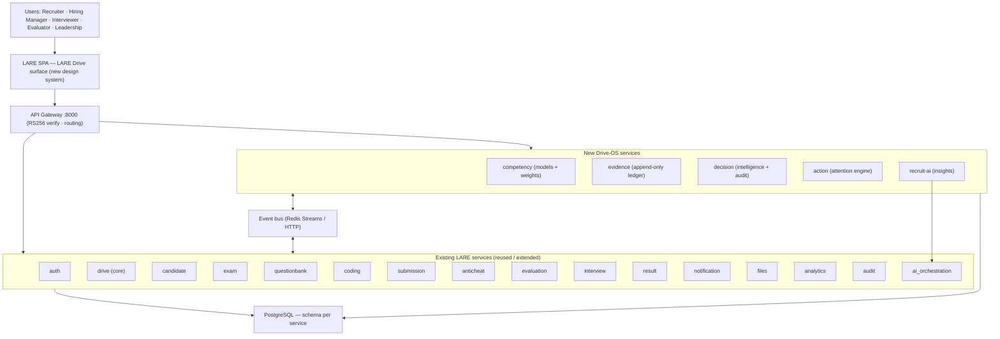

# LARE Drive — Production Architecture (Phase 2)

**Status:** Phase 2 design — **Phases 3 (frontend) and 4 (backend) implemented.** See §15 for the delivered state.
**Scope:** Evolve the existing LARE Hire/Drive product into the approved **Recruitment Operating System** without breaking the running LARE platform.

---

## 1. Principles

1. **Evolve, don't replace.** Reuse the platform's proven spine — API gateway, RS256 JWT, schema‑per‑service Postgres, the event bus, `lare_common`, and the React SPA. LARE Drive is a product surface + a set of new/extended services on that spine, not a parallel stack.
2. **Evidence is the primary record.** Every score is derived from typed, sourced, append‑only **evidence**. Rankings, decisions, and AI insights all trace back to evidence rows.
3. **AI recommends, humans decide.** Every AI output is `Observation → Reason → Impact → Recommended Action`, is stored, and is auditable. No unexplained magic numbers.
4. **The Drive is the operating unit.** A Drive owns intent, competencies, rounds, pool, evidence, evaluations, decisions, actions, and outcomes. Its interface is generated from its configuration.
5. **Role‑shaped surfaces.** Recruiter, Hiring Manager, Interviewer, Evaluator, Leadership, Super Admin get *different operating surfaces*, not the same page with hidden buttons.
6. **Production‑minded from day one.** RBAC, auditability, empty/loading/error states, real‑time, accessibility, and scale are first‑class.

---

## 2. Ubiquitous language (the operating model)

```
Drive → Intent → Competencies → Rounds → Candidate Signals → Evidence → Evaluation → Decision → Action → Outcome
```

| Term | Definition |
|---|---|
| **Drive** | A hiring mission (roles, intent, competencies, rounds, pool, analytics, outcomes). |
| **Intent** | The narrative + weighted priorities that frame every decision in the drive. |
| **Competency** | A named, weighted dimension the drive hires for (e.g. System Design). |
| **Round** | A configurable stage (screening, assessment, interview, decision) that generates the journey. |
| **Signal** | A raw observation about a candidate (assessment result, interview capture, referral). |
| **Evidence** | A typed, sourced, confidence‑tagged record derived from a signal, mapped to a competency. |
| **Evaluation** | A structured, per‑competency assessment (from an interviewer or an engine) that emits evidence. |
| **Decision** | An evidence‑weighted advance/hold/reject with coverage, agreement, and an audit trail. |
| **Action** | A prioritised, system‑derived item that requires human attention. |
| **Insight** | An AI observation with reason, impact, and a recommended action. |
| **Outcome** | The terminal result (hired, declined, dropped) with the full evidence lineage. |

---

## 3. System context



LARE Learn is untouched. The gateway gains routes for the new services under the existing `/drive/v1` prefix family.

---

## 4. Service decomposition

### 4.1 Reused / extended (existing schemas)
| Service | Role in Drive OS | Change |
|---|---|---|
| **auth** | Identity, RS256 JWT, roles | Add recruitment roles + permissions (§9). |
| **drive** (`drive_core`) | Drive, roles, eligibility, **rounds**, registrations, funnel | Extend: `intent`, competency links, round `stage_key`, pipeline health snapshot. |
| **candidate** | Candidate profile, applications | Unchanged. |
| **exam / questionbank / coding / submission / anticheat** | Assessment take‑flow + proctoring | Emit **signals** to the evidence ledger on completion. |
| **evaluation** | Auto‑grading, ranks | Becomes an **evidence producer** (per‑competency), not just a total score. |
| **interview** | Scheduling, ratings, decisions | Ratings become **structured evaluations** → evidence; add briefing payload. |
| **result** | Offers, outcomes | Consumes decisions; unchanged contract. |
| **notification / files / analytics / audit** | Cross‑cutting | Analytics gains recruitment facts; audit chains decisions. |
| **ai_orchestration** | Governed AI egress + `ai_calls` audit | Hosts recruitment prompts (§8). |

### 4.2 New services
| Service (schema) | Owns | Why separate |
|---|---|---|
| **competency** (`drive_competency`) | Competency catalogue, per‑drive **evaluation models** (weights), bands | The evaluation model changes independently of the drive lifecycle. |
| **evidence** (`drive_evidence`) | **Append‑only evidence ledger**, competency mapping, confidence, conflict detection | The system of record for "why"; must be immutable + auditable. |
| **decision** (`drive_decision`) | Decisions, evidence coverage, panel agreement, sign‑off, audit lineage | Decision logic + auditability is a bounded concern distinct from results. |
| **action** (`drive_action`) | The **attention engine** — derives, prioritises, and tracks actions | Action intelligence is derived state over many services; needs its own projections. |
| **recruit-ai** (`drive_recruit_ai`) | Insight generation (O/R/I/A), calibration drift, comparison framing | Recruitment‑specific AI logic; calls `ai_orchestration` for egress. |

> New services follow the identical shape (`manage.py`, `app/`, `lare_common`) and get their own schema.

---

## 5. Data model (new tables — conceptual)

**`drive_competency`**
- `competencies` — id, key, name, description.
- `evaluation_models` — id, drive_id, created_at (one active per drive).
- `model_weights` — model_id, competency_key, weight, band_thresholds(json).

**`drive_evidence`** (append‑only; no UPDATE/DELETE grants)
- `evidence` — id, drive_id, candidate_id, competency_key, **source_type** (assessment|interview|coding|referral|screen), source_ref, **signal** (float 0–100), **confidence** (high|medium|low), rationale, actor_id, round_key, created_at.
- `evidence_conflicts` — id, candidate_id, competency_key, evidence_a, evidence_b, delta_bands, status(open|resolved), detected_at. *(materialised by a conflict detector)*

**`drive_decision`**
- `decisions` — id, drive_id, candidate_id, round_key, verdict(advance|hold|reject), decided_by, **evidence_coverage_pct**, **panel_agreement**(aligned|divergent), **missing_competencies**(json), confidence, note, created_at.
- `decision_evidence` — decision_id, evidence_id (the exact evidence the decision cites — immutable lineage).

**`drive_action`**
- `actions` — id, drive_id, kind, priority(critical|high|medium), title, detail, target_ref, impact_note, status(open|resolved|dismissed), created_at, resolved_by. *(regenerated by the attention engine; resolution is user state)*

**`drive_recruit_ai`**
- `insights` — id, drive_id, severity, title, observation, reason, impact, recommended_action(json), related_refs(json), created_at, model, mode(live|stub).
- `calibration` — interviewer_id, competency_key, drive_id, mean_delta_bands, sample_n, window, computed_at.

**`drive_core` additions**
- `drives.intent` (text), `drives.priorities` (json weighted), `drives.pipeline_health` (json snapshot).
- `rounds.stage_key`, `rounds.sla_days`, `rounds.eval_required` (int, e.g. 2 evaluations before offer).

---

## 6. API design (new surface, existing conventions)

All under `/drive/v1`, envelope `{data,meta,errors}`, RS256, RBAC + subject‑ownership.

**Pipeline & drive state**
- `GET /drives/{id}/pipeline` → ribbon state: stages, occupancy, health, SLA, bottleneck flags.
- `GET /drives/{id}/readouts` → instrument metrics + 7‑day series + deltas.

**Evidence & evaluation**
- `POST /evidence` — `{ drive_id, candidate_id, competency_key, source_type, source_ref, signal, confidence, rationale, round_key }` (append‑only).
- `GET /candidates/{id}/evidence?drive_id=` → ledger rows + conflict flags.
- `POST /interviews/{id}/evaluation` — structured per‑competency capture → emits evidence rows.
- `GET /drives/{id}/evidence` → drive‑wide ledger (Evidence Ledger surface).

**Candidate intelligence**
- `GET /drives/{id}/candidates` → signal cards: per‑competency evidence roll‑up, **decision confidence**, risk, next action.
- `GET /candidates/{id}/intelligence?drive_id=` → coverage, agreement, conflicts, evidence, recommended next action.
- `GET /drives/{id}/compare?a=&b=` → comparison framing (evidence deltas + priority‑weighted recommendation).

**Decision intelligence**
- `GET /drives/{id}/decisions/queue` → finalists with coverage/agreement/missing/confidence.
- `POST /decisions` — `{ candidate_id, round_key, verdict, note, evidence_ids[] }` (records lineage + audit event).

**Action & insights**
- `GET /drives/{id}/actions` → prioritised attention queue. `POST /actions/{id}/resolve`.
- `GET /drives/{id}/insights` → AI insights (O/R/I/A). `POST /insights/generate` (recompute).
- `GET /drives/{id}/calibration` → interviewer drift.

---

## 7. Event & data flow

```mermaid
sequenceDiagram
  participant EXAM as exam/coding
  participant EVID as evidence
  participant COMP as competency
  participant ACT as action
  participant AIx as recruit-ai
  EXAM->>EVID: signal completed (score, per-competency)
  EVID->>EVID: append evidence + detect conflicts
  EVID-->>ACT: event: evidence.added / conflict.opened
  ACT->>COMP: fetch weights → recompute decision confidence
  ACT->>ACT: derive/prioritise actions (blocking evals, SLA, conflicts)
  AIx->>EVID: read evidence → generate insight (O/R/I/A)
  AIx->>AIO: egress via ai_orchestration (audited)
  Note over ACT,AIx: humans act; decisions cite exact evidence (immutable lineage)
```

Bus events (Redis Streams / HTTP fan‑out): `evidence.added`, `evidence.conflict.opened`, `evaluation.submitted`, `decision.made`, `round.published`, `sla.breached`. Consumers: action engine, recruit‑ai, analytics, notification, audit.

---

## 8. AI architecture (workflow‑native)

- **Where:** candidate intelligence roll‑ups, evidence synthesis, conflict/risk detection, bottleneck detection, comparison framing, interviewer‑drift calibration, decision support.
- **Contract:** every insight is stored as `observation, reason, impact, recommended_action, related_refs` — the UI renders exactly that; the recommendation is a real action link.
- **Governance:** all egress goes through `ai_orchestration` and is logged in `ai_calls` (model, mode live/stub, tokens, latency). Budget via `AI_MAX_TOKENS`.
- **Determinism & trust:** structural computations (coverage, agreement, drift, confidence) are **deterministic** (not LLM) so they're reproducible; the LLM only *narrates* and *frames*. Provider failure degrades to the deterministic layer, clearly badged.
- **Human‑in‑the‑loop:** AI never writes a decision; it only proposes actions a human executes.

---

## 9. RBAC & security

**Roles → surface + permissions**
| Role | Primary surface | Can |
|---|---|---|
| Recruiter | Command Center | operate drives, resolve actions, record evidence, propose decisions |
| Hiring Manager | Candidate Intelligence | view evidence/quality, comment, approve decisions |
| Interviewer | Interviewer Workspace | see only assigned interviews, submit structured evaluations |
| Evaluator | Evidence/Decisions | review evidence, cast evaluations, no scheduling |
| Leadership | Analytics | read‑only health, calibration, forecasting |
| Super Admin | Configuration | manage roles, models, automation, org config |

- **Enforcement:** gateway verifies RS256; each service checks `require_roles` **and** subject scoping (interviewer sees only their assignments; candidates never see internals).
- **Immutability & audit:** evidence + audit are append‑only (DB grants revoke UPDATE/DELETE); decisions are hash‑chained in `audit`.
- **Isolation:** schema‑per‑service; least‑privilege `search_path`; TLS end‑to‑end.

---

## 10. Frontend architecture

- **Placement:** a redesigned **LARE Drive** surface inside the existing SPA (`/drive/...`), behind the product chooser; LARE Learn untouched.
- **Design system (LARE Drive):** tokenised dark‑first + light themes; the **visual grammar** becomes a component library:
  - `PipelineRibbon`, `ReadOut` (+ `Delta`, sparkline), `Ledger`, `Stream`, `AIBlock` (O/R/I/A), `CandidateSignalCard`, `DecisionCard`, `AttentionItem`, `CommandPalette`, `Drawer`.
- **State:** a typed store (drives, candidates, evidence, decisions, actions, insights) with React Query‑style server cache; optimistic action‑resolution; SSE/websocket for live pipeline + actions.
- **Routing/guards:** role‑shaped landing (`setRole` → surface); `require_roles` mirrored client‑side for affordances only (server is authoritative).
- **Real‑time:** the Command Center, PipelineRibbon, and Action queue subscribe to bus‑backed SSE so state is live.
- **Quality:** empty/loading/error/skeleton states for every surface; keyboard‑first (⌘K, arrow nav); WCAG AA contrast in both themes; virtualised lists for large pools.

---

## 11. Non‑functional targets

| Attribute | Target / approach |
|---|---|
| Performance | Signal‑card roll‑ups precomputed by the action engine; ledger paginated + virtualised; readouts served from analytics projections. |
| Scale | Stateless services behind LB; evidence/action projections are the hot path — cache + Redis Streams. Large pools (10k+) via server‑side filter/sort/paginate. |
| Real‑time | SSE from bus events for pipeline/actions/insights. |
| Availability | No cross‑service hard dependency for read surfaces; degrade to last projection. |
| Auditability | Immutable evidence + hash‑chained decisions; every AI call logged. |
| Accessibility | AA contrast, focus states, reduced‑motion, semantic roles. |
| Security | RS256, RBAC + subject scoping, schema isolation, TLS. |

---

## 12. Migration (non‑breaking)

1. **Additive first.** Add new schemas/services + `drive_core` columns; existing Drive endpoints keep working.
2. **Backfill evidence.** Emit evidence from existing exam/coding/interview data via a one‑time migration + ongoing events; no destructive change.
3. **Dual‑run UI.** Ship the new LARE Drive surface behind a flag; keep the current recruiter console until parity.
4. **Cut over per drive.** New drives use the OS model; legacy drives finish on the old flow.

---

## 13. Delivery plan (per your workflow)

- **Phase 3 — Frontend implementation:** build the LARE Drive design system + component library, wire to mocked/contract APIs, all approved surfaces, dark/light, RBAC affordances, real‑time stubs.
- **Phase 4 — Backend implementation:** new services (competency, evidence, decision, action, recruit‑ai), `drive_core` extensions, event wiring, AI prompts via `ai_orchestration`.
- **Phase 5 — Integration + testing:** contract tests, evidence→decision lineage tests, calibration math, load tests on the action/evidence hot path, seed dataset.
- **Phase 6 — Hardening:** RBAC/audit review, immutability grants, performance, accessibility, security.
- **Phase 7 — Deployment:** additive migration, flagged rollout, per‑drive cutover, observability.

---

## 14. Open decisions for your review

1. **New services vs. modules.** I've proposed 5 new services for clean bounded contexts. If you prefer a lighter footprint, `evidence`+`decision`+`action` could start as modules inside `drive` and split later. **Recommendation:** separate `evidence` (immutability) + `recruit-ai`; keep `decision`/`action` as modules initially.
2. **Real‑time transport.** SSE (simpler, fits the process model) vs. websockets. **Recommendation:** SSE.
3. **AI provider for Drive.** Continue Mistral (current Drive default) or align with Gemini. **Recommendation:** keep provider abstract via `lare_common.ai`; pick per cost/quality.
4. **Calibration scope.** Per‑drive vs. cross‑drive interviewer calibration. **Recommendation:** per‑drive first, cross‑drive later.

---

*Phase 2 design ends here.*

---

## 15. Delivered state (Phases 3 & 4)

**Open decisions — resolved (recommended defaults adopted):** (1) `evidence` and `recruit-ai` are separate services for immutability/AI isolation; `decision` and `action` were also built as their own services for clean bounded contexts. (2) Real-time transport: SSE (deferred — surfaces poll/refresh today). (3) AI provider kept abstract; recruit-ai narrates deterministically today (mode `derived`), LLM narration via `ai_orchestration` is additive. (4) Calibration is per-drive first.

**Phase 4 — backend services (implemented).** Five new services on the existing spine, each schema-per-service, RS256/RBAC, `lare_common`, registered in `services.txt`, the gateway (`ROUTES`/`UPSTREAMS`), and `internal.SERVICE_URLS`:

| Service | Schema | Port | Route prefix | Delivers |
|---|---|---|---|---|
| evidence | `drive_evidence` | 8027 | `/drive/v1/evidence` | Append-only ledger; auto-records from `evaluation.completed`; conflict detection; confidence-weighted deterministic roll-ups; publishes `evidence.added` / `evidence.conflict.opened`. |
| competency | `drive_competency` | 8028 | `/drive/v1/competency` | Competency catalogue + per-drive weighted evaluation models (one active per drive). |
| decision | `drive_decision` | 8029 | `/drive/v1/decisions` | Evidence-cited decisions with immutable lineage; deterministic coverage / panel-agreement / confidence; decision queue. Publishes `decision.made`. |
| action | `drive_action` | 8030 | `/drive/v1/actions` | Attention engine — derives prioritised actions from live conflicts + decision queue; idempotent regeneration; user resolution preserved. |
| recruit-ai | `drive_recruit_ai` | 8031 | `/drive/v1/insights`, `/drive/v1/calibration` | Deterministic O/R/I/A insights + interviewer calibration drift vs consensus. |

Cross-service reads are best-effort east-west (`ServiceClient`) and degrade gracefully — no hard dependency for read surfaces. Evidence/decision metrics are **deterministic** (no LLM), so they are reproducible and auditable; the LLM only narrates later.

**Phase 3 — frontend (implemented).** Cross-drive Command Center; the Drive console as an operating unit with perspective lenses; visual grammar library (`grammar.jsx`: ReadOut, Ribbon, Attention, AIObservation, SignalCard, Delta, Spark); Evidence Ledger, Decision Intelligence queue, Interviewer Workspace, Candidate Comparison, and a ⌘K command palette — all on the real services, with derived-signal fallbacks on fresh drives.

**Hardening & completion (implemented).**
- **Evidence immutability:** `init-db` installs a PostgreSQL `BEFORE UPDATE/DELETE` trigger on `evidence` (no-op on SQLite), making the ledger append-only at the database, not just the app layer.
- **Evidence backfill:** `POST /drive/v1/evidence/backfill/{drive_id}` turns historical Round 1 marks into assessment evidence (idempotent), surfaced by a "Backfill from marks" button in the Evidence Ledger.
- **LLM narration:** recruit-ai sharpens each insight's impact line via `lare_common.ai` when a provider key is present (`mode=live`), degrading to deterministic `derived` otherwise. Structure stays deterministic; only prose changes.
- **Evaluation-model authoring:** the Configure tab edits the per-drive weighted competency model (`drive-competency`), with auto-normalising weights.
- **Near-real-time:** the Command Center auto-refreshes funnel + intelligence every 25s (no flicker), with a Live indicator.

**Still future.** True bus-backed **SSE** streaming (deferred deliberately: browser `EventSource` cannot send the RS256 bearer, and long-lived server streams risk worker exhaustion across 27 services — the safe path is a fetch-stream endpoint + gateway query-token support); DB `REVOKE` grants as a second immutability layer; per-competency (not just overall) evidence emission from coding/interview sources; cross-drive calibration.
